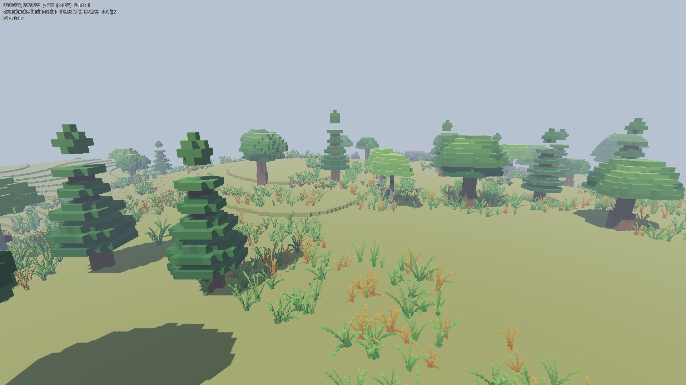
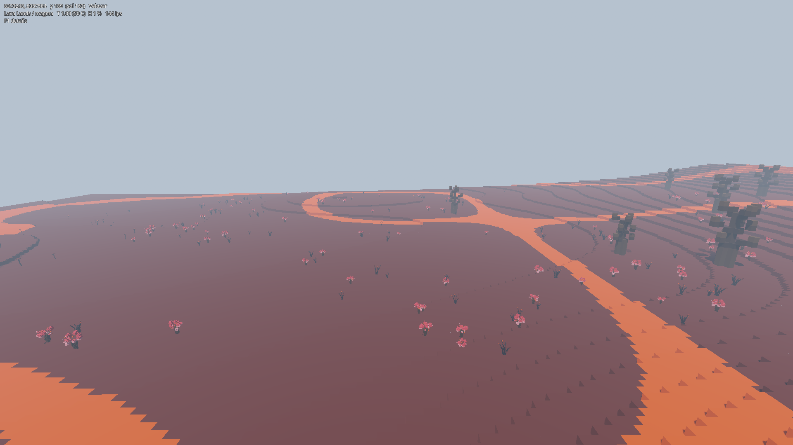
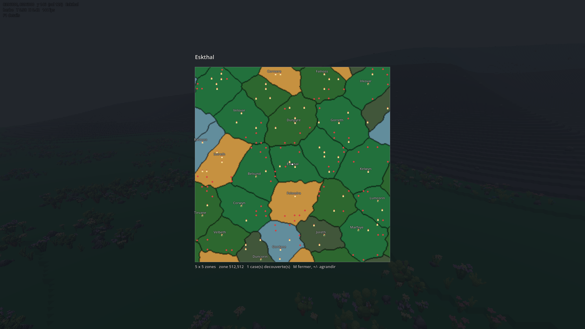

# Zentarys

Réimplémentation « clean room » des systèmes de jeu de l'alpha 2013 de
**Cube World**, sur Godot 4.7 et Voxel Tools 1.7.

L'objectif est de comprendre et de réécrire les **algorithmes** du jeu —
génération de terrain, climat, comportements, réseau — à partir d'une analyse
statique du binaire, puis d'en produire une implémentation originale en
GDScript idiomatique.

## État

**Le jalon 1 — le monde — est complet.** Bruit de valeur, LCG, sites de région,
mélanges climatiques, champ d'altitude, réseau de chenaux, éléments de tuile
(bourgs, cratères, caldeiras, pitons), générateur voxel et rendu en cubes
colorés. S'y ajoutent une couche de flore instanciée — dispersée selon les deux
fréquences de bruit de l'original, et **choisie par sa règle de sélection**,
deux crêtes de bruit qui donnent à chaque région sa composition —, l'édition du
terrain avec sauvegarde du seul diff, l'éclairage voxel, et la carte du monde :
un puzzle de régions, chacune la cellule de son site dans le domaine déformé,
avec ses noms et sa découverte.

**Le monde a six biomes** — Greenlands, Snowlands, Deserts, Jungles, Lava Lands,
Oceans. Un biome est une zone *climatique* : il décide ce qui pousse, tandis que
la matière du sol — herbe, sable, neige, roche nue, magma — est une conséquence
du biome et de l'altitude. Chacun porte son propre lot de modèles : **43 pour la
flore basse**, dessinés à 3/40 de bloc par voxel, et **24 pour les arbres**,
dessinés à la maille du bloc comme le terrain lui-même.

Deux chantiers suivent : la fin du **jalon 1.11**, le tronc d'arbre écrit dans le
terrain — donc la collision —, et le **jalon 2**, créatures et comportements, en
commençant par les points d'apparition, dont les constantes sont déjà relevées.

- `docs/ROADMAP.md` — les cinq jalons, leur avancement, les mesures
- `docs/systems/01_generation_terrain.md` — l'analyse du système de terrain
- `docs/systems/02_contenu_de_biome.md` — contenu de biome, dispersion, entités,
  table de sélection du décor
- `docs/systems/03_colonnes_et_edition.md` — colonnes, blocs, édition, sauvegarde
- `docs/systems/04_eclairage.md` — éclairage voxel : les deux passes
- `docs/systems/05_carte_du_monde.md` — carte, découverte, noms de région
- `docs/prompt_generation_flore.md` — la commande du lot de flore
- `docs/prompt_generation_arbres.md` — la commande du lot d'arbres
- `nextsteps.md` — reprise de session : chemins, commandes, invariants, pièges

## Démarrer

```
godot --headless --path . -s tests/worldgen_test.gd   # 312 vérifications
```

Scène de démonstration : `scenes/terrain_demo.tscn`. Clic pour capturer la
souris, ZQSD/WASD, **clic gauche** creuser, **clic droit** poser, **F1**
détails, **Page haut/bas** distance de vue, **M** carte du monde, **1-6**
téléportation vers un biome, **Échap** rend la souris puis quitte. Les
modifications du terrain sont conservées dans `user://saves`, une base par
graine ; seuls les blocs édités y sont écrits, le reste du monde se régénère.
Les cases de carte parcourues y sont gardées de même.








## Périmètre et mention légale

**Cube World**, son code, ses assets, ses noms et ses marques appartiennent à
**Picroma et Wollay (Wolfram von Funck)**, ses créateurs. Ce dépôt n'est ni
affilié, ni approuvé, ni soutenu par eux.

Il s'agit d'un projet amateur non officiel, à but éducatif et de recherche
d'interopérabilité. Il ne contient **aucun binaire, asset ou fichier de données
du jeu d'origine** (`Cube.exe`, `data*.db`, `*.plx`, textures, sons, palette) —
uniquement du code écrit ici, à partir du comportement documenté des
algorithmes.

Ce qui relève de l'expression artistique plutôt que de l'algorithme — palettes
de couleurs, apparence des créatures, textes de quête, noms propres — est
remplacé par une création originale et signalé comme tel dans la note du
système concerné. La palette de ce projet (`assets/palette/`) est entièrement
originale.

Si vous détenez des droits sur Cube World et souhaitez qu'un élément soit
modifié ou retiré, ouvrez une issue.
