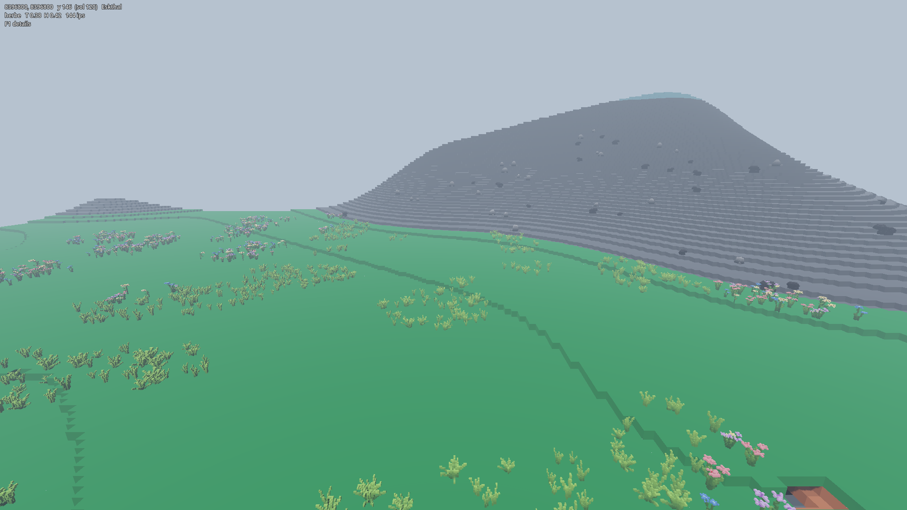

# Zentarys — feuille de route

Réimplémentation « clean room » des systèmes de jeu de l'alpha Cube World sur
Godot 4.7.2 + Voxel Tools 1.7.

**Cadre.** On porte des *algorithmes*, jamais du code ni des données. Aucun
asset du jeu d'origine (`.plx`, `data*.db`, textures, sons, palette) n'entre
dans ce dépôt. Toute expression artistique reconnaissable — palettes, silhouettes
de créatures, noms propres, textes — est remplacée par une création originale et
signalée comme telle dans la note du système concerné.

**Source d'analyse.** `qad3n/CubeWorld-Reversal` : reconstruction par classe
(RTTI + graphe d'appels) du binaire alpha 2013. 1 370 fonctions de jeu côté
client, 288 côté serveur ; le reste est de la bibliothèque tierce (SQLite, CRT,
STL, FreeType) et n'a pas à être porté.

**Méthode, par système.** Analyse du pseudo-code → note dans
`docs/systems/NN_*.md` → implémentation GDScript typée → test headless qui
verrouille les invariants numériques → validation visuelle en jeu.

Statuts : ✅ fait · 🔶 partiel · ⬜ à faire · ⛔ hors périmètre

---

## Jalon 1 — Le monde

Le terrain conditionne tout le reste : physique, rendu, placement des créatures
et des structures.

**Les dix systèmes du terrain sont portés et vérifiés** (1.1 à 1.10) : le monde
se génère, se creuse, se sauvegarde, s'éclaire, se garnit et se cartographie.
**Deux systèmes sont ouverts par-dessus**, et ni l'un ni l'autre ne remet le
terrain en cause :

- **1.11**, la grande végétation — un lot d'assets et une seconde couche de
  dispersion. Assets et dispersion faits ; reste le tronc écrit dans le terrain ;
- **1.12**, les six biomes — une couche de classification climatique au-dessus
  des matières de surface, et la refonte des deux lots d'assets qui en découle.
  **Fait le 2026-09-06.**

Le reste des points ouverts est de la finition, listée en dette technique, plus
les questions d'analyse encore pendantes de `docs/systems/02`, §9.

| # | Système | Source analysée | Statut | Note |
|---|---|---|---|---|
| 1.1 | Bruit de valeur | `valueNoise2D` @004d5d30 | ✅ | `docs/systems/01` |
| 1.2 | LCG de la CRT MSVC | `World_generateRegionSite` | ✅ | idem |
| 1.3 | Sites de région, climat | `World_{temperature,humidity}Blend` | ✅ | idem |
| 1.4 | Champ d'altitude, chenaux | `World_baseHeightField` @004f9b70 | ✅ | idem |
| 1.5 | Générateur voxel + rendu cubes | — (portage Godot) | ✅ | idem |
| 1.6 | Éléments de tuile | `World_generateRegionFeatures` @0050e080 | ✅ | `docs/systems/01`, §2.7 |
| 1.7 | Contenu de biome, dispersion | `creature_generateAppearance` + @005e4850 + @005d8750 + @005f0ce0 | ✅ | dispersion, 39 modèles, **table de sélection portée** ; `docs/systems/02` |
| 1.8 | Colonnes persistantes, édition | `Chunk_getColumnAt` @00406100 + `VoxelTool` | ✅ | `docs/systems/03` |
| 1.9 | Éclairage voxel | `VoxelChunk_propagateSunlight` @0059a0e0 | ✅ | porté, rendu passé en `COLOR_RAW` ; `docs/systems/04` |
| 1.10 | Carte du monde | `WorldMap.cpp`, `loadLandscapeTile` @006024d0, `NameGen_generateRegionName` | ✅ | pièces de Voronoï, découverte, noms ; `docs/systems/05` |
| 1.11 | **Arbres et grande végétation** | voie des entités, `docs/systems/02` §5.2 | 🔶 | **assets (24 + 9 filons) et dispersion faits, arbres en jeu** ; reste le tronc écrit dans le terrain (collision) et la pose des filons |
| 1.12 | **Les six biomes** | climat de 1.3 + biomes de l'alpha 2013 | ✅ | couche `CWBiome` au-dessus des matières, Lava Lands et ses coulées, **43 modèles de flore et 24 d'arbres regénérés** |

### 1.6 — Éléments de tuile (fait)

Grille 8 × 8 d'éléments par zone, un par tuile de 2048 unités. Cinq types
déforment l'altitude — bourg (aplanissement + `World_roadField`), cratère à
`H−50`, deux caldeiras à bord relevé, piton de +150 — plus un relèvement qui
fait émerger un îlot sous tout élément posé sur un site océanique. Détail et
constantes dans `docs/systems/01`, §2.7.

Trois points relevés à l'analyse, qui n'étaient pas dans le plan :

- **Le type 1 n'est pas « les routes ».** Il y a un et un seul élément de type 1
  par zone, sur la tuile de son site : `World_roadField` est l'aplanissement du
  bourg, pas un réseau de voies. Les arêtes du graphe de sites ne sont donc pas
  des routes, et `site_edge_radius` reste à 0.
- **Les types 13 et 9 ne sont jamais produits** par
  `World_generateRegionFeatures` : son `switch(rand()%8)` ne rend que 2, 3,
  4/15, 5, 6/15, 7/15, 11 et 12. L'effet du 13 (piton de +150) est porté ; les
  deux types sont pourtant traités par `generateBiomeContent`, donc une passe de
  placement reste à trouver. Le 9 y construit un `cube::Spawn`.
- **Les types sans effet sur l'altitude sont quand même placés** (2, 3, 5, 10,
  11, 12, 14, 15). Le flux aléatoire est une seule séquence : n'en porter que la
  moitié changerait tous les types et toutes les positions. Ce sont les ancres
  du jalon 1.7.

`World_featureTier` @004d7870 est porté et gradue la difficulté depuis le centre
de la carte (zone 512, 512).

### 1.7 — Contenu de biome (fait)

**Fait.** La mécanique de dispersion et le rendu sont portés, testés et mesurés :
`CWVoxelModel` (un `.vox` en liste creuse, quatre quarts de tour précalculés,
ancre au centre de l'empreinte et à la base, maillage à l'échelle fine),
`CWModelLibrary` (chargement partagé, table modèle/biome, densités), `CWScatter`
(cellules de 16 blocs, une graine par cellule, position sous le bloc, cache sous
mutex) et `CWFloraRenderer` (un `MultiMesh` par modèle et par cellule, cellules
construites par lots sur un fil du pool, détruites au-delà de la distance de vue
de la flore). 33 vérifications dans `tests/flora_test.gd`. Coût : **1,1 ms par
cellule** de 256 colonnes en prairie, hors du fil principal — et **plus rien** sur
le chemin de génération du terrain.

**Les 28 modèles du lot de flore sont livrés et intégrés** (2026-09-05), en 39
fichiers rangés par biome : plusieurs rôles ont reçu un modèle par biome plutôt
qu'un fichier partagé, et `CWModelLibrary.FLORA` porte donc des chemins. 5 650
plantes se posent sur 576 cellules d'essai, toutes dans leur biome et sur leur
sol. Trois réparations ont été nécessaires avant que le lot arrive en jeu — la
palette des fichiers, deux plages de palette inutilisables, et les noms ; le
détail est dans `nextsteps.md`, §6.

> **Le piège de la palette, à ne pas redécouvrir.** Le rendu lit un *index*,
> jamais une couleur. Les 39 fichiers sont arrivés avec les bonnes teintes aux
> mauvais index, parce que la planche de référence avait été glissée sur le
> nuancier de MagicaVoxel, qui la rééchantillonne. Rien ne le signale : ni le
> chargement, ni les tests d'alors, seulement l'écran. Le geste correct est
> d'**ouvrir `assets/palette/zentarys_palette.vox`** ; `tools/repaint_models.gd`
> répare un lot déjà peint.

**L'échelle des assets est fixée** — c'était le point bloquant, elle n'est
déductible d'aucune décompilation.

> **Deux grilles.** Le terrain a un pas d'un bloc, les modèles un pas treize fois
> plus fin : **1 bloc = 40/3 voxels de modèle**, soit **3 blocs = 40 voxels** ;
> **personnage de référence = 32 voxels = 2,4 blocs**, touffe d'herbe à 0,9 bloc.
> Le rapport était de 16 jusqu'au 2026-09-05 ; il est passé à la valeur exacte de
> l'original, `0,075 = 3/40`. C'est ce rapport qui sépare
> ce rendu de celui de Minecraft, et il est mesuré au pixel sur une capture du
> jeu d'origine — le brin d'herbe et la pupille du personnage y font la même
> largeur, donc la flore et les personnages sont sur la même grille fine.

Conséquence d'architecture, prise le 2026-09-04 : **la flore n'est plus estampée
dans les données voxels du monde**, elle y serait treize fois trop grosse. Elle
est maillée à part — même mailleur, même palette, même matériau que le terrain,
ce qui est la condition pour que les deux grilles lisent comme un seul monde —
puis instanciée. Ce qu'on perd : la flore ne se creuse pas, ne porte pas de
collision, ne participera pas à l'éclairage voxel du jalon 1.9. Ce qu'on gagne :
elle quitte le chemin critique de génération, qui est le poste dominant du
chargement.

Méthode, mesures et gabarits dans `assets/models/MODELS.md`. À revoir au jalon
3.1, quand la physique du joueur donnera la taille réelle du personnage : c'est
alors le nombre de blocs qui bougera, pas le rapport de 16, qui est un contrat
d'authoring.

**Reste.** `WorldInfo_generateBiomeContent` (@005e4850, 4 200 lignes) a reçu une
première passe d'analyse le 2026-09-05 : **`docs/systems/02`**. Elle n'est pas ce
que son nom annonce — c'est le constructeur d'une cellule de 256 × 256 colonnes,
et **elle ne disperse pas de flore**. Ce qui en est sorti : le champ de densité
de végétation à quatre octaves (constantes exactes), l'identité de quatre types
d'éléments de tuile (6 = champ de rochers, 11 = massif isolé, 12 = plan d'eau,
3 = parcelle bâtie), les constantes de pose des points d'apparition pour le
jalon 2.6, et une corroboration indépendante du portage du jalon 1.6 (stride
`0x68`, base `+0x14018`, ordre `tz + tx·8`).

**La table modèle/biome est trouvée** (2026-09-05, seconde passe). Elle n'était
dans aucune des deux fonctions au nom prometteur : `generateVegetationCluster`
(@005d8750) est le *résolveur de contenu d'une tuile*, pas un disperseur. La
table est le `switch` d'apparence de `creature_generateAppearance`
(game_misc.cpp:3197), croisé avec les slots de chargement de `GameController`.

> **Flore, filons et créatures sont un seul espace de types d'entités.** Codes
> 120–130 = plantes, 131–139 = filons, 145–155 = poissons, en dessous les
> créatures. Une touffe d'herbe et un ours sont la même sorte d'objet : une
> entité portant un code, jamais de la matière écrite dans le terrain. **La
> décision du 2026-09-04 de sortir la flore des données voxels est donc confirmée
> par la source** — pour une raison qui n'avait pas été anticipée.

Les boîtes englobantes du `switch` sont en blocs de terrain et **recoupent
l'échelle fixée ici** : `thorn-tree` 12 blocs, `cactus1` 4 blocs, buisson 2 blocs
— soit le personnage de référence. La sélection se fait sur le **type de bloc de
surface**, pondérée par température et humidité, jamais sur un identifiant de
biome : c'est exactement la forme de `CWPalette.surface_index`. Tables complètes,
rareté des filons comprise, en `docs/systems/02`, §5.

**Ce qui bloque encore le portage :** la numérotation des blocs de l'original
n'est pas celle de `CWPalette`, et la correspondance reste à établir — recopier
la table telle quelle mettrait des cactus dans les marais.

**La seconde voie de pose est identifiée** (`docs/systems/02`, §8). Il y a bien
deux voies : les plantes à silhouette sont des **entités** (§5), la flore basse
est du **décor instancié** sans entité, produit dans la même passe que le
terrain, en fin de boucle de colonne, et poussé par
`ChunkBuffer_loadAndNotify` (@005c03f0). L'enregistrement est reconstruit :
type à +0, échelle à +32, lacet à +36, drapeaux à +56.

> **Le rapport d'échelle est confirmé par une constante du binaire.** Les
> échelles de décor valent 0,075 / 0,09 / 0,1 — et **0,075 = 1/13,333
> exactement**. La feuille de route avait obtenu ~13 voxels par bloc par une
> mesure au pixel sur une capture, et retenu 16 ; le binaire porte la même
> valeur, par un chemin entièrement différent. La mesure à l'œil était juste.
> Le projet est donc à 16 là où l'original est à 13,33 : nos modèles sont
> **20 % plus fins** à bloc égal. `VOXELS_PER_BLOCK = 16` reste délibéré — une
> puissance de deux vaut mieux qu'un rapport bâtard — mais l'écart est
> désormais chiffré.

**Les deux manques de `CWFloraRenderer` sont comblés** (2026-09-05) : la gigue
d'échelle de 1× à 2× par instance, et les deux fréquences de bruit. Ce que le
portage a appris, au-delà de ce qui était prévu :

- **la crête à 0,05 est le mécanisme de groupement**, et il n'y en a pas
  d'autre. La dette « semer par grappes » n'était pas du code à écrire : la
  crête passe 29,2 % de la surface en plaques de 19,1 blocs, ce qui donne des
  paquets serrés et de larges vides. Mesuré après portage : variance/moyenne de
  **14,3** par cellule contre ~1 pour un tirage uniforme, 195 cellules vides
  sur 576 ;
- **la rareté entière (`rand()%8 == 0`) n'est pas portée, délibérément.**
  L'original la tire par colonne, ce qui suppose 256 échantillonnages par
  cellule — ~19 ms, hors budget. `CWScatter` tire un budget de candidats et ne
  paie la colonne qu'après la crête. Même moyenne : 256 × 0,2917 × 1/8 = 9,3
  plantes par cellule, contre les 9,8 que donnait la densité posée au jugé.
  Deux chemins indépendants, le même nombre ;
- **le test de signe se généralise par la parité de l'indice**, pas en deux
  moitiés contiguës — sans quoi une région sort à 40 % de cailloux, la table
  groupant les modèles par nature. Le défaut s'est vu en jeu, pas dans un test.

Détail et mesures en `docs/systems/02`, §8.3 et §8.4. Coût : la cellule de flore
passe de 1,07 à 1,29 ms, toujours hors du fil principal.

**La table type de décor → modèle est trouvée, et portée** (2026-09-05,
sixième passe). Elle n'était pas dans une fonction : elle est dans le
**tableau des slots de chargement**. `GameController_load_game_assets` range
2 449 modèles `.cub` à des indices qui ne suivent pas l'ordre de chargement, et
le décor y occupe un bloc contigu ; la relation est `slot = 2418 + type`, tenue
par cinq recoupements indépendants pris dans trois fonctions — le roseau sur
sol humide, les deux nénuphars sur l'eau, les **huit enseignes** pour les huit
genres de bâtiment, le lierre et les rosiers de mur, l'art incan. Réserve
documentée : la même base ne tient pas sous le type 22, où les cinq couvre-sols
demandent une base décalée de cinq — les deux lectures s'accordent en revanche
sur la *nature* de chaque décor, et c'est elle qui est portée. `docs/systems/02`,
§8.5.

**Ce que le portage a changé** (`src/worldgen/cw_decor_rules.gd`) :

- **il y a deux crêtes de sélection à 0,01, pas une**, de décalages différents
  — `(9843, 8437)` pour la famille, `(34234, 234234)` pour la variante. Mesuré :
  leurs signes ne s'accordent que 50,8 % du temps, soit le hasard, donc la
  seconde dit bien quelque chose que la première ne dit pas. C'est **le**
  mécanisme de composition régionale, et il était deviné jusqu'ici : la parité
  d'indice de `CWScatter._choose` était une invention de ce projet, elle est
  retirée ;
- **le second seuil est biaisé** (`n2 <= 0,5` et non `<= 0`), ce qui garde la
  variante minoritaire à une fois sur quatre. Prairie sur 4 000 points après
  portage : couvert 43,5 %, fleur 41,0 %, caillou 8,4 %, sous-bois 7,0 % ;
- **les échelles disent la taille du rôle** : 0,075 est la référence — soit
  exactement `3/40`, le rapport de ce projet —, le roseau et le nénuphar sont à
  1,2×, le caillou à 1,33-1,6×, le sous-bois humide à 0,67-1,33× ;
- **une seule rareté est empilée sur la crête**, `rand()%100` pour le couple
  humide et froid. Les autres `%8` et `%10` sont le tirage par colonne déjà
  remplacé par le budget de candidats ; les réappliquer les compterait deux fois.

La table par biome de `CWModelLibrary` devient une table **par rôle** : les 39
modèles sont répartis en neuf rôles (couvert, fleur, caillou, sous-bois, rare,
roseau, algue, corail, fond), et deux vérifications tiennent la correspondance —
aucun rôle atteignable sans modèle, aucun modèle rangé sous un rôle
inatteignable. 271 vérifications au total à cette date.

**Ce qui reste ouvert**, et ce n'est plus bloquant : le nénuphar (pas de modèle
dans le lot, et `surface_index` ne rend jamais `WATER`), le lacet libre de trois
rôles (le mailleur ne précalcule que quatre quarts de tour), et la crête de
placement à 0,6 que la source emploie sur le sol végétalisé là où ce projet en
garde une seule à 0,5 — c'est un réglage de taille de plaque, et
`PLACEMENT_PASS_RATE` est calibré sur 0,5.

**Correction de sources.** Onze noms du dépôt d'analyse sont trompeurs — les
quatre derniers sont venus avec la carte, et sont détaillés en
`docs/systems/05`, §8 :

- `WorldInfo_scatterObjectsInArea` (@005f56c0), listée ici comme seconde source
  de 1.7, **ne disperse pas d'objets** : elle choisit la liste d'espèces d'un
  point d'apparition selon le climat et le niveau, et son résultat est écrit
  dans un `cube::Spawn`. C'est du jalon 2.6.
- `World_generateTreeRecursive` (@005d9460) **ne génère pas d'arbres** : son
  corps est de la gestion de cellules de région et de `cube::Spawn`. Le corpus
  n'emploie « tree » que pour les arbres rouge-noir de la STL. Appelée en fin de
  `generateBiomeContent`, c'est une finalisation de cellule.
- `WorldInfo_generateBiomeContent` (@005e4850) **n'est pas le contenu de biome**
  mais le constructeur d'une cellule de 256 × 256 colonnes. `docs/systems/02`.
- `terrain_generateColumnColor` **ne rend pas une couleur** mais une hauteur de
  colonne : sa valeur sert de base d'altitude et devient une coordonnée Y.
- `World_placeObjectWithSpacing` **ne place rien** : elle rend un poids scalaire
  par colonne, facteur du champ de densité de végétation.
- `World_generateVegetationCluster` (@005d8750) **ne disperse pas de
  végétation** : c'est le résolveur de contenu d'une tuile. `docs/systems/02`, §7.
- `creature_generateAppearance` (`game_misc.cpp:3197`) **n'est pas propre aux
  créatures** : son `switch` couvre aussi les plantes, les filons et les
  poissons. C'est la table code d'entité → modèle. `docs/systems/02`, §5.
- `hash_or_index_compute` (@00602440) **ne calcule pas de hachage** : c'est
  `WorldMap::getTile`, l'indexation de la grille de cases de carte.
- `GameController_tryLockAndProcess` (@005fc160) **n'est pas un enrobage de
  verrou** : c'est `WorldMap::markDiscovered`, le seul point d'écriture de la
  découverte.
- `locked_pair_update` (@00601cc0) **ne met rien à jour** : c'est la recherche du
  site de région le plus proche, déjà portée en `CWTerrainField.nearest_site`.
- `Terrain_sampleHeightNoise` (@0059fc90) **n'échantillonne pas une altitude** :
  c'est la déformation du domaine à ±500, rendue en unités de zone.

### Assets à produire

Le jalon 1.6 n'a demandé aucun asset. Le jalon 1.7 est le premier qui en demande.

Le binaire d'origine charge **2 550 modèles voxels nommés** (`.cub`) ; leurs noms
donnent la liste sûre des *rôles* que le monde doit remplir. Le chiffre de 154
retenu jusqu'ici était une énumération partielle — relevé corrigé le 2026-09-05,
`docs/systems/02`, §6.2. Aucun n'est repris — ce sont des créations
originales — mais la liste des besoins, elle, ne se devine plus.
Liste par biome, noms de fichiers et ordre de production dans `nextsteps.md`,
§8.2. En résumé :

- **28 modèles pour le jalon 1.7** ✅ **faits** (39 fichiers, un dossier par
  biome), repartis sur les neuf surfaces que `CWPalette.surface_index` sait
  produire ; plus 5 cultures pour les champs, à faire ;
- **14 arbres et houppiers, plus 9 filons, pour le jalon 1.11** ✅ **faits**
  (2026-09-05) — même chemin de production que la flore : un document de
  commande, un script Blender, une graine en dur par fichier. Les filons sont le
  premier lot à **1 voxel = 1 bloc**, parce qu'ils s'estampent dans le terrain et
  doivent se miner ;
- **~50 pour le jalon 4** : mobilier, artisanat, décor extérieur et de donjon ;
- le reste (objets d'inventaire, créatures, interface) vient plus tard.

**Les arbres sont des assets — correction du 2026-09-05, complétée le même
jour.** La feuille de route affirmait le contraire. Le corpus charge nommément
`fir-tree.cub`, `thorn-tree.cub`, `christmas-tree.cub`, `tree-leaves.cub`,
`palm-leaf.cub`, `palm-leaf-diagonal.cub` et `wood-log.cub`. Il n'y a **pas** de
générateur d'arbre récursif à porter : `World_generateTreeRecursive` (@005d9460)
est nommée d'après les arbres rouge-noir de la STL, elle finalise une cellule.
La composition est **tranchée** depuis : `tree-leaves` porte son propre code
d'entité (143), loin des deux arbres (129, 130), donc le conifère et l'arbre à
épines sont des modèles entiers tandis que le feuillu et le palmier sont des
assemblages dont le tronc n'est pas un modèle. `docs/systems/02`, §5.2 ; travaux
en §1.11.

**Les maisons, elles, ne sont pas des assets.** `cube::House::ctor_0(3, 3, 4)`
montre qu'une maison est une grille de 3 × 3 × 4 cellules remplie
procéduralement — ce sont les meubles qui sont des modèles, pas le bâtiment. Un
algorithme à porter, pas un lot à dessiner.

Gabarits mesurés en sortie du générateur d'éléments, utiles pour situer les
échelles — le rayon est un rayon d'*influence*, la distance sur laquelle
l'élément revendique le terrain, pas l'encombrement du modèle :

| type | par zone | rayon | position | variantes |
|---|---|---|---|---|
| 14 | ~16 | 150 u | calée sur la grille de 256 | 4, plus 2 réservées aux climats très humides |
| 11 | ~2 | 128 u | calée sur la grille de 256 | — |
| 12 | ~2 | 128 u | calée sur la grille de 256 | — |
| 10 | ≤ 5 | 512–767 u | libre dans la tuile | — |
| 2 | ~2 | 512–767 u | libre dans la tuile | — |
| 3 | ~2 | 512–767 u | libre dans la tuile | 3 |
| 5 | ~2 | 256–511 u | libre dans la tuile | 3, choisies par le climat du site |
| 15 | variable | 512–767 u | libre dans la tuile | remplace 4, 6 et 7 au-dessus d'un site océanique |

L'identité de chaque type reste à établir : elle vient de
`WorldInfo_generateBiomeContent` (@005e4850), pas encore analysée.

Authoring : MagicaVoxel, palette de projet chargée en **ouvrant
`assets/palette/zentarys_palette.vox`** — et pas en glissant un PNG sur le
nuancier, qui décale les index sans rien dire. Plages réservées documentées dans
`assets/palette/PALETTE.md`. À l'import, `vox(x, y, z) -> godot(y, z, x)`.
**Échelle et conventions de fichiers : `assets/models/MODELS.md`** — c'est le
document à donner à qui modélise.

Pas d'éditeur voxel maison : la seule objection sérieuse était l'impossibilité de
descendre sous le voxel dans MagicaVoxel, et elle tombe avec le rapport de 16 —
sa grille est sans unité, on ne réduit pas le pinceau, on agrandit la boîte.
L'établi de personnalisation façon Cube World reste au programme comme
*fonctionnalité de jeu* (jalon 3.2/4, sur l'inventaire), pas comme outil de
production ; il réutilisera `CWVoxelModel` tel quel.

---

### 1.8 — Colonnes persistantes et édition (fait)

Analyse complète en **`docs/systems/03`**. Sept fonctions courtes et sans
ambiguïté — le système le mieux déterminé rencontré jusqu'ici.

**L'échelle du monde est confirmée par un second chemin.**
`Chunk_getColumnAt` refuse toute coordonnée hors de `[0, 0x1000000)`, soit
exactement `CWWorldParams.WORLD_SIZE`, obtenu jusqu'ici en multipliant 1024 zones
par 16 384 unités. Deux lectures indépendantes, le même nombre. `Grid_lookup1024`
borne à `0..0x3ff` — c'est la grille de zones — et `Region_getChunkCell` à
`0..0xffff`, soit 16 777 216 / 256. Trois recoupements.

**Un échelon manquait à l'échelle du monde :** le **chunk de 256 × 256
colonnes**, entre la tuile de 2 048 et le bloc — huit par huit dans une tuile.
C'est la cellule que construit `WorldInfo_generateBiomeContent` : les deux
analyses, menées séparément, décrivaient le même objet sans qu'on sache où le
ranger.

**La structure d'origine n'est pas portée, délibérément.** Grille de chunks,
colonnes paginées, plages redimensionnables : c'est exactement ce que
`VoxelTerrain` fait déjà, en natif. La réécrire serait porter une
implémentation. Ce qui est porté, ce sont les règles qu'aucun moteur ne devine.

> **L'eau n'est pas de la matière, c'est le vide sous le niveau de la mer.**
> `World_getBlockAt` ne lit jamais un bloc d'eau : au-dessus de la colonne il
> rend un témoin d'eau si `z <= 0` et un témoin d'air sinon, et il rabat de même
> un bloc *stocké* de type nul sous la même altitude. Le niveau de la mer de
> l'original est `z = 0` — `CWWorldParams.sea_level` valait déjà 0. Creuser sous
> la mer laisse donc de l'eau, pas un trou : une tranchée depuis la plage se
> remplit. C'est `CWWorldEdits.erase_value`.

Deux relevés qui n'étaient pas cherchés :

- **un bloc d'origine fait quatre octets : trois de couleur RVB et un
  d'attributs** (type sur 5 bits, drapeau 0x40, protection 0x80).
  `World_fillVoxelColumnTyped` donne à chaque bloc sa teinte, avec une gigue de
  table et un canal vert poussé vers 120 par un échantillon de bruit. Ce projet
  est en palette indexée par choix de rendu — mais cela éclaire peut-être la
  **dalle d'eau du LOD 1** restée inexpliquée : une couleur survit à une moyenne
  de résolution, un index de palette non. Piste, pas démonstration ;
- **la protection (0x80) empêche la génération d'effacer un bloc posé par une
  structure** — écrire de l'air y est refusé en silence, écrire de la matière
  repose le drapeau. Pas de producteur avant le jalon 4, et pas de place dans un
  canal d'un octet : documentée, non portée.

**Persistance.** `VoxelStreamSQLite` avec `save_generator_output = false`, un
fichier par graine : le monde intact reste procédural, seul le diff part sur le
disque — le modèle de l'original, qui ne sérialise que les colonnes touchées.
647 éditions occupent 20 Ko, écrites en 4 ms.

**Une régression attrapée par la validation en jeu, pas par les tests :**
fermer par `--quit-after` ou par un `SceneTree.quit()` direct n'envoie pas
`WM_CLOSE_REQUEST`, donc la sauvegarde ne partait pas — 647 éditions appliquées,
zéro écrite, sans un mot. `NOTIFICATION_EXIT_TREE` est le second filet.

**Ce que 1.8 laisse ouvert :** la flore ne réagit pas aux éditions — creuser un
cratère y laisse les plantes en l'air. C'est la conséquence connue de la
décision du 2026-09-04, devenue visible ; la corriger demande une requête par
plante, donc c'est un sujet du jalon 1.9. Les collisions ne sont pas branchées
non plus : `CWWorldEdits.voxel_at` est la primitive, le consommateur est le
contrôleur du jalon 3.1.

---

### 1.9 — Éclairage voxel (fait)

**L'algorithme est entièrement établi**, `docs/systems/04`. Deux passes : une
descente du soleil par colonne, puis **seize itérations** de diffusion
**purement horizontale**, atténuation **multiplicative `× 0,85`** par bloc (et
non le `− 1` de Minecraft), avec un **plancher de 5/255** qui empêche tout recoin
de tomber au noir. Le type 13 est une **source de lumière** à 255. Le double
tampon explique la disposition d'octets relevée au jalon 1.8 : pour un voxel
transparent, les trois premiers octets ne sont pas une couleur mais
suivant / courant / publié.

Trois types de blocs sont nommés au passage — **0 air, 2 eau, 13 lampe**. Ce
sont les trois premiers points d'ancrage vers la correspondance de numérotation
qui bloque `docs/systems/02`, §9.

> **Sur un monde intact, l'éclairage ne change rien.** Le terrain porté est un
> champ de hauteurs pur : la passe A répond « éclairé au-dessus, noir en
> dessous », et le dessous n'est jamais visible. La lumière ne devient visible
> que dans ce que le joueur a creusé — c'est-à-dire ce que le jalon 1.8 vient
> d'ouvrir.

**Ce qui bloquait n'était pas le calcul, c'était le rendu — et la décision est
prise.** `VoxelMesherCubes` n'a pas de canal de lumière : en mode palette il cuit
la couleur du nuancier dans les sommets, et il n'y a nulle part où loger une
luminosité par voxel. Le rendu est donc **passé en `COLOR_RAW`** — une couleur
par voxel au lieu d'un index — ce qui est **exactement ce que fait l'original**.
Un voxel porte maintenant deux choses : son **type** dans `CHANNEL_TYPE`, qui
reste ce que lit tout le code raisonnant en blocs, et sa **couleur** dans
`CHANNEL_COLOR`, que seul le mailleur lit. La palette reste la source des
couleurs et le contrat d'authoring : **les 39 modèles de flore n'ont pas été
repeints.**

**`CWLight` porte les deux passes**, et le terrain généré ne l'appelle pas : un
champ de hauteurs est éclairé partout où on le voit, donc la lumière ne sert que
là où le joueur a creusé. Deux choix d'implémentation ont porté tout le gain :

- les deux passes sont indexées dans **l'ordre natif de `VoxelBuffer`** (Y
  d'abord), ce qui permet de leur passer le canal de types tel quel — trente-six
  mille `get_voxel` de moins par coup de pioche ;
- `shaded_cells` **pousse la lumière depuis l'air vers ses voisins pleins** au
  lieu de sonder chaque bloc, si bien que la roche enterrée ne coûte rien.

Un coup de pioche isolé passe ainsi de 71 à **30 ms**, à profil de lumière
inchangé.

**Fait dans ce jalon :** la flore suit désormais le terrain édité. Creuser sous
une touffe la laissait en l'air — conséquence connue de la sortie de la flore
des données voxels (2026-09-04), devenue visible avec 1.8. `CWWorldEdits` tient
le sommet plein des colonnes éditées, calculé sur le fil principal au moment de
l'édition, et `CWScatter` y consulte un dictionnaire — rien sur le chemin chaud,
et pas de `VoxelTool` lu depuis un fil du pool.

> **Un piège de repère, et un test qui passait au vert pour rien.**
> `CWWorldEdits` travaille en coordonnées de scène, comme `VoxelTool` ;
> `CWScatter` en coordonnées monde. La première version rangeait la table dans
> le mauvais repère : la recherche ne tombait jamais juste et la flore
> continuait de flotter, **sans qu'aucune vérification ne bronche** — les deux
> côtés du test employaient le même repère. C'est la capture en jeu qui l'a
> montré. Le test traverse maintenant la conversion.

---

### 1.10 — Carte du monde (fait)

Analyse complète en **`docs/systems/05`**. Onze fonctions, dont quatre dont le
nom du dépôt d'analyse dit autre chose que ce qu'elles font.

**Une pièce de carte est une cellule de Voronoï.** C'est le résultat qui n'était
pas prévisible depuis l'apparence du jeu : `loadLandscapeTile` (@006024d0) balaie
la zone plus une zone de marge, déforme chaque point de la grille de chunks et ne
garde que ceux dont le **site de région le plus proche** est celui de la zone.
La carte n'est donc pas un quadrillage : c'est un puzzle aux frontières
ondulées — et ces frontières sont **exactement celles du climat**, puisque le
mélange de sites du jalon 1.3 travaille sur le même point déformé.

Conséquence pratique : **le jalon 1.10 n'apporte aucune constante numérique
nouvelle.** `World_getColumnDataAt2` est mot pour mot `CWTerrainField.warped_point`,
et la recherche du plus proche site est `nearest_site`, portée au jalon 1.6. La
carte assemble ce que le terrain avait déjà.

**L'échelle du monde est confirmée une troisième fois.** `WorldMap::getTile`
(@00602440, nommée `hash_or_index_compute` dans le dépôt) borne ses coordonnées à
`[0, 0x10000)` et indexe en deux temps, `>> 6` puis `& 63` : une case de carte
vaut **256 unités**, c'est-à-dire le chunk retrouvé au jalon 1.8, et il y en a
64 × 64 par zone.

**L'image stockée ne porte pas de couleur.** Le remplissage n'écrit que trois
valeurs, et elles sont grises : `200` là où aucune case n'existe, `220` pour une
case connue, `255` pour une case découverte. La teinte vient du dessin. Le
portage garde cette séparation — la clarté est une propriété du chunk, la teinte
une propriété de la région, et elles ne se rencontrent qu'au rendu.

**La découverte** tient en une fonction de dix lignes (`WorldMap::markDiscovered`,
@005fc160) : un bit par chunk, et un compteur — le seul état que l'original
persiste, en quatre octets sous la clé `discovered`.

**Les marqueurs sont les éléments de tuile du jalon 1.6**, relevés une troisième
fois par le couple stride `0x68` / base `+0x14018`. Rien de neuf à générer : la
couche existait, il fallait savoir qu'elle alimentait la carte.

**Les noms de région** sont deux syllabes tirées de deux tables de vingt,
indexées en croix par le point déformé ramené en unités de zone :
`tableA[(a*3 + graineA + b) % 20] + tableB[(b*3 + graineB + a) % 20]`. Le
mécanisme est porté à la lettre ; **les syllabes, elles, ne le sont pas** — ce
sont des créations artistiques du jeu d'origine, et `CWRegionName` porte deux
tables écrites pour ce projet.

> **Septième nom trompeur.** `Terrain_sampleHeightNoise` (@0059fc90)
> n'échantillonne pas une altitude : c'est la déformation du domaine à ±500,
> rendue en unités de zone. C'est `CWTerrainField.edge_warped_point`, portée au
> jalon 1.4. Trois autres noms sont corrigés en `docs/systems/05`, §8.

**Porté :** `CWWorldMap` (dalles, découverte, teintes, marqueurs, rendu),
`CWRegionName`, l'affichage `CWMapOverlay` (touche **M**, `+`/`−` pour élargir),
la persistance de la découverte par graine, et `tools/preview_map.gd` pour
regarder une carte sans lancer le jeu. 56 vérifications dans `tests/map_test.gd`.

**Trois écarts délibérés**, pesés en `docs/systems/05`, §7 : une dalle de 64 × 64
par zone plutôt qu'une pièce à sa boîte englobante (même géométrie, cache qui se
juxtapose sans recouvrement) ; une teinte de région échantillonnée à son site ;
la mer peinte en eau, parce que `surface_index` rend du sable sous le niveau de
la mer — juste pour le terrain, illisible sur une carte.

**Coût :** une dalle de 4 096 cases en **43 ms**, une vue de 5 × 5 zones en
1,4 s à froid, sur un fil du pool ; se recentrer ne recalcule que les zones qui
entrent dans le cadre. Un nom coûte 14 µs.

> **Un défaut de dessin que seul le jeu a montré.** Poser les seules ancres d'un
> `Control` sous un `CanvasLayer` le laisse de taille nulle : tout le dessin
> partait d'une origine négative et la carte sortait par le coin supérieur
> gauche. Aucune vérification ne pouvait broncher — un nœud invisible calcule
> juste. Ce sont les ancres **et les marges** qu'il faut poser.

**Ce que 1.10 laisse ouvert :** les six modèles de marqueurs
(`map-tile-{plains,village,forest,mountains,hills}.cub`, `skull.cub`) sont des
assets à produire ; l'affichage dessine des glyphes en attendant. Le type 14
reste sans identité — la carte l'a montré autrement : le compter comme village
en met dix-huit par région.

---

### 1.11 — Arbres et grande végétation (assets faits, code à faire)

Le jalon 1.7 a porté la **flore basse** : ce qui pousse au sol, treize fois plus
fin qu'un bloc, instancié sans entité. Il ne couvre pas **ce qui a une
silhouette** — arbres, grands buissons, cactus dressés, filons affleurants —, qui
passe dans l'original par une voie entièrement différente, celle des entités
(`docs/systems/02`, §5). C'est le seul contenu du monde qui manque encore, et il
change beaucoup l'aspect d'un biome.

**Ce que la source donne, et c'est presque tout.** Le code d'entité indexe le
tableau de chargement à une base près : **`slot = 1969 + code`**, tenu par treize
valeurs consécutives (`docs/systems/02`, §5.2). D'où, sans ambiguïté :

| code | modèle | ce que c'est |
|---|---|---|
| 129 | `fir-tree` | un conifère, **modèle entier** |
| 130 | `thorn-tree` | un arbre à épines, **modèle entier**, boîte 3 × 3 × **12 blocs** |
| 143 | `tree-leaves` | un **houppier**, posé séparément |
| 131-139 | les neuf filons | affleurements minéraux, rareté en `docs/systems/02` §5.4 |

**Le feuillu n'est pas un modèle.** `tree-leaves` porte son propre code, loin des
deux arbres, et le corpus ne contient ni `tree-trunk`, ni `oak`, ni équivalent :
un feuillu est donc un **assemblage**, un tronc surmonté de houppiers instanciés.
Le tronc n'étant pas un modèle non plus, il est très probablement écrit dans le
terrain en colonnes de blocs — l'original en a la primitive,
`World_fillVoxelColumnTyped` (@005df600). Le palmier suit la même construction :
`palm-leaf` et `palm-leaf-diagonal` sont deux palmes, il n'y a pas de palmier.
Ce qui reste à trouver est **l'assembleur** — la fonction qui pose un tronc puis
ses houppiers —, sans doute inlinée dans `generateBiomeContent`.

> **Correction d'une affirmation ancienne.** `assets/models/MODELS.md` §4 et une
> version antérieure de cette feuille disaient « les arbres sont construits par
> le code, pas des modèles à dessiner ». C'est faux pour le conifère et l'arbre
> à épines, qui sont des `.cub` nommés, et à moitié vrai pour le feuillu, dont
> seul le tronc est procédural. Les deux textes sont corrigés.

**Trois choses à faire, dans cet ordre.**

**1 — Le lot d'assets, par le même chemin que la flore. ✅ Fait le 2026-09-05.**
Le lot des 39 modèles de flore est produit par script —
`tools/blender/generer_flore.py`, une graine en dur par fichier, le lot se
régénère à l'identique —, et le document qui a servi à le commander est
`docs/prompt_generation_flore.md`. Le lot d'arbres a suivi exactement ce chemin :
`docs/prompt_generation_arbres.md` pour la commande,
`tools/blender/generer_arbres.py` + `arbres_formes.py` pour la production, les
mêmes garde-fous — palette de projet recopiée verbatim, index hors plages
refusés à l'écriture, enveloppe vérifiée. **14 modèles livrés** sous
`assets/models/arbres/<biome>/` :

| surface | modèles |
|---|---|
| herbe | `tronc_feuillu`, `houppier_01`, `houppier_02` |
| herbe sèche | `arbre_sec`, `houppier_sec` |
| jungle | `tronc_palmier`, `palme`, `palme_diagonale`, `houppier_jungle` |
| marais | `arbre_mort` |
| sable | `palmier_dattier` (réemploie `palme`) |
| neige | `sapin`, `sapin_enneige` |
| toundra | `sapin_rabougri` |

Mesures réelles : les trois futs font 88 à 105 voxels de haut (6,6 à 7,9 blocs)
pour moins d'un bloc de rayon ; les quatre houppiers 47 à 53 de haut pour 28 à
32 de rayon (2,4 blocs) ; le `sapin` 111 pour 14 de rayon. Le rayon maximum du
lot est de 32 voxels, soit 3 blocs.

> ⚠️ **Ce lot est à refaire — l'échelle et le grain sont faux.** Constaté le
> 2026-09-05 au soir sur trois captures du jeu d'origine. Les arbres y sont
> **six à dix fois le personnage** (15 – 25 blocs, contre 8,3 pour notre
> `sapin`), leurs houppiers sont des **dômes en parasol de 10 à 18 blocs de
> large, plus larges que hauts** (contre 4,8 blocs, aussi hauts que larges), et
> surtout leurs cubes de feuillage lisent **à la taille du bloc de terrain** —
> un arbre y est bâti des mêmes cubes que le monde, pas de ceux de la flore.
>
> Deux raisons de le croire au-delà de l'œil. D'abord la **provenance de
> l'échelle** : `0,075 = 3/40` est relevée dans la voie du *décor* (§8.3), et
> aucune échelle n'a été relevée dans la voie des *entités*, par où passent les
> arbres — ce lot reposait donc sur une extrapolation. Ensuite l'**argument
> structurel** : §5.2 établit que le tronc est écrit dans le terrain en colonnes
> de blocs et que le houppier est instancié séparément ; ces deux moitiés ne se
> rejoignent proprement que si la grille du houppier est celle du bloc. Un voxel
> = un bloc explique l'architecture de la source, 3/40 la rend impossible.
>
> **La couche de dispersion et le montage restent valables** ; ce sont le grain
> et les tailles qui changent. Chiffres cibles, effets de bord et ordre des
> travaux : `nextsteps.md`, §6.

**Deux points d'ancrage relevés à la production, qui concernent l'assemblage :**

- **l'ancre d'un modèle est le centre de son gabarit**, pas le pied du tronc
  (`CWVoxelModel.load_from`). Les futs sont donc dessinés presque d'aplomb —
  au-delà, l'arbre se poserait à côté de son propre tronc. Pour les palmes, dont
  le point d'attache est à une extrémité, l'écart est structurel : l'assembleur
  devra porter un décalage d'attache explicite, il ne peut pas le déduire du
  modèle ;
- **le tronc existe en deux formes** et ce n'est pas une contradiction :
  `tronc_feuillu` et `tronc_palmier` sont des modèles instanciables, là où la
  source écrit le tronc en colonnes de blocs. L'assemblage écrira la matière là
  où il faut qu'on la creuse et qu'elle porte collision ; le modèle sert au
  bosquet lointain et à la réduction de niveau de détail.

Plus les **neuf filons** (code 131-139), qui sont un lot à part : ceux-là se
dessinent à **1 voxel = 1 bloc** et s'estampent dans le terrain, puisqu'on doit
pouvoir les miner. C'est le premier lot de ce genre du projet, et
`assets/models/MODELS.md` §3 en donne déjà la règle. **Dessinés le 2026-09-05**,
sous `assets/models/filons/`, une fois la décision de palette prise :

> **La décision.** Les filons demandaient neuf **types de bloc** et la réserve
> terrain 14 – 31 était pleine. Des trois issues posées par
> `docs/prompt_generation_arbres.md`, aucune n'a été prise telle quelle. La plage
> équipement (96 – 127) aurait fait porter à un bloc minable un index déclaré
> « armes et équipement », c'est-à-dire organisé la panne que le découpage
> existe pour éviter. Réemployer des entrées existantes est impossible depuis
> 1.9. Restait la troisième — déplacer une frontière —, dont le prix annoncé
> était « invalide tous les modèles déjà peints » ; il ne l'était que si on les
> déplace **toutes**.
>
> `RANGE_TERRAIN_END` passe donc de 31 à 40 et `RANGE_CREATURES_BEGIN` de 32 à
> 41, **et rien d'autre**. Aucun modèle n'est à repeindre, vérifié plutôt que
> supposé : les 53 modèles du dépôt n'emploient que 14 – 29 et 128 – 175. La
> plage créatures perd neuf entrées sur 64 et n'en a **aucune de peinte**,
> l'apparence des créatures étant hors périmètre — c'est ce qui rend l'opération
> gratuite, et c'est pour cela qu'elle est possible aujourd'hui et ne le sera
> plus au jalon 2. Les neuf index sont consécutifs et alignés sur les codes
> d'entité : `index = 32 + (code − 131)`, verrouillé par un test, comme la table
> de rareté de §5.4 (fer 70 %, or 10 %, argent 10 %, émeraude 9,1 %, saphir
> 0,5 %, rubis 0,3 %, diamant 0,1 % — portée verbatim dans `CWPalette.roll_ore`).

**Ce qui reste des filons** est leur *pose* : où affleure un filon, selon quelle
roche et quelle profondeur. Elle appartient à la voie des entités, avec les
points d'apparition du jalon 2.6 — c'est là que le tirage de rareté trouvera son
appelant.

**2 — Une seconde couche de dispersion, et non un élargissement de la première.
✅ Faite le 2026-09-05.** `CWScatter` calcule sa marge sur
`CWModelLibrary.max_radius_blocks`, tous modèles confondus (invariant n° 17).
Ranger un houppier dans la même bibliothèque ferait passer cette marge de 2 blocs
à 9 pour **toute** la flore : `placements_in` balaierait une couronne de cellules
cinq fois plus large, et chaque `MultiMesh` d'herbe porterait une boîte de
visibilité démesurée. D'où une couche jumelle, `CWTreeScatter`, qui **hérite** de
`CWScatter` — cache de cellules, verrou, reprise après édition et requête
d'empreinte sont identiques — et redéfinit ce qui diffère :

- **cellule de 64 blocs** (16 << 2, donc une cellule d'arbres couvre exactement
  seize cellules de flore : la conversion des cellules salies par une édition est
  un décalage, sans perte) ;
- **bibliothèque à part**, `CWModelLibrary.shared_trees()`. Mesuré : rayon
  maximum 2 blocs pour la flore, 3 pour les arbres. Deux maxima, deux marges ;
- **espacement minimum réel entre deux troncs**, 7 blocs. Le mécanisme est celui
  de la source (comparaison sur le carré de la distance, §6) ; la valeur ne l'est
  pas, et il faut le dire — les 20 unités de §6 appartiennent à la boucle des
  points d'apparition, qui place des `cube::Spawn`, et à 20 blocs d'écart aucune
  forêt ne serait possible. La règle est **sans état et sans récursion** : chaque
  cellule tire ses candidats de sa seule graine, et un candidat est écarté si un
  candidat de **rang absolu inférieur** du voisinage 3 × 3 est trop proche. Comme
  l'espacement est inférieur à la cellule, la décision est la même quelle que
  soit la cellule qui la pose. Vérifié par un test, frontières comprises ;
- **crête de placement à 0,02** au lieu de 0,05. Même forme, même seuil, mêmes
  décalages ; seule la fréquence change, et c'est ce qui **répond à la question
  laissée ouverte ci-dessous** : les arbres se décident sur leur propre champ. À
  0,05 les plaques font 19 blocs — la taille d'une touffe, pas d'un peuplement —
  et partager la crête de la flore aurait mis chaque arbre dans une plaque
  d'herbe, deux couches corrélées à cent pour cent se lisant comme une seule.

**Le montage est fait au niveau de l'instance**, pas encore de la matière :
`CWTreeRules` tient les espèces et leurs trois montages — arbre entier, feuillu
(un tronc puis un à trois houppiers empilés en se chevauchant), palmier (un stipe
puis une couronne de palmes). Toutes les pièces d'un arbre partagent leur
colonne, leur altitude et leur échelle ; les houppiers se posent à une hauteur
**fractionnaire** (`Placement.fy`, ajouté pour eux), la hauteur d'un tronc étant
un nombre de voxels divisé par 40/3 qui ne tombe pas sur un bloc.

**3 — L'assemblage.** Un feuillu se pose en deux temps : un tronc écrit dans les
données voxels (donc il se creuse, et il porte collision), puis un à trois
houppiers instanciés au-dessus. C'est le premier objet du projet qui traverse les
deux mondes — la matière et l'instance —, et c'est ce qui le rend intéressant :
`CWWorldEdits` sait déjà écrire, `CWFloraRenderer` sait déjà instancier, il faut
les faire poser au même endroit et rester d'accord après une édition.

**Ce qu'il faudra décider :**

- **la collision.** La flore n'en a pas, et c'est délibéré. Un arbre de 12 blocs
  qu'on traverse se remarque tout de suite. Le tronc écrit dans le terrain la
  donne gratuitement ; le houppier, non.
- **la réduction en distance.** `CWVoxelModel.reduced(n)` est prêt et ne sert
  encore à rien. Un arbre est le premier modèle assez gros pour la justifier.
- ~~**la sélection.**~~ **Tranché le 2026-09-05 : son propre champ.** Le rôle
  `ARBRE` ne rejoint pas `CWDecorRules.FAMILIES`, pour deux raisons. Les deux
  crêtes de la flore sont à 0,01 et tranchent une *famille de décor* — de l'herbe
  contre des fleurs ; un arbre ne concourt pas avec le couvert pour la même
  place, il se pose par-dessus. Et la source les sépare elle-même : la flore
  basse est du décor poussé en fin de boucle de colonne, les arbres passent par
  la voie des entités. Détail dans `CWTreeRules`, en-tête.

**Dépend de :** 1.7 (les rôles, la bibliothèque, le mailleur), 1.8 (l'écriture
dans le terrain, pour le tronc). **Débloque :** un paysage lisible à distance, et
le premier usage réel de la réduction de niveau de détail.

---

### 1.12 — Les six biomes (fait, 2026-09-06)

Jusqu'ici, « biome » voulait dire `CWPalette.surface_index` : **neuf matières de
bloc** qui servaient aussi de clé aux tables de flore, d'arbres et de densité.
Les deux notions y étaient confondues, et ça se voyait dès qu'on essayait de
dire une phrase simple — une crête rocheuse au-dessus d'une prairie n'est pas un
« biome roche », une île au milieu de l'océan porte la végétation de la terre
ferme, une plage n'est pas un désert.

**Un biome est désormais une zone climatique**, il y en a six, et il décide *ce
qui pousse*. La **matière de surface** est une conséquence du biome et de
l'altitude, et elle décide *ce qu'on voit et ce qu'on creuse*. `CWBiome` fait la
première moitié, `CWPalette.surface_of` la seconde.

Les six sont ceux de l'alpha 2013 — Greenlands, Snowlands, Deserts, Jungles,
Lava Lands, Oceans. Ce sont des noms du jeu d'origine, gardés parce qu'ils
nomment une *classification* et non un asset ; le contenu de chacun est une
création de ce projet.

#### Ce que le champ de climat a imposé, et qu'aucun raisonnement n'aurait donné

`tools/biome_stats.gd` balaie le champ réel sur 144 zones éloignées et rend la
répartition. Il a servi trois fois, et à chaque fois il a contredit une règle
qui se lisait juste. Le tableau croisé des terres, en pourcents :

| t \ h | 0-20 % | 20-40 | 40-60 | 60-80 | 80-100 |
|---|---|---|---|---|---|
| 0,0 – 0,2 | 10,68 | 0,05 | 0,04 | 0,03 | 14,00 |
| 0,2 – 0,4 | 0,01 | 0,06 | 8,03 | 6,52 | 1,35 |
| 0,4 – 0,6 | 0,00 | 0,02 | 8,74 | 11,87 | 1,05 |
| 0,6 – 0,8 | 0,01 | 0,05 | 5,55 | 8,39 | 0,08 |
| 0,8 – 1,0 | 11,52 | 0,04 | 0,04 | 0,04 | 11,81 |

**Le champ est bimodal.** Les quatre coins portent 48 % des terres ; un point
chaud est soit très sec, soit très humide, jamais entre les deux. La première
règle de Lava Lands prenait justement la bande d'humidité laissée libre entre le
désert et la jungle aux hautes températures : elle rendait **60 colonnes sur
147 456**. Baisser son seuil de température de 0,88 à 0,80 n'a rien changé — 64.
*Une règle peut être juste et vide.*

Ce qui marche est de découper dans le coin chaud-sec, tout en haut : au-dessus
de 0,97 de température, le mélange climatique ne produit que le **cœur d'une
région dont le site est à l'extrême**. Lava Lands est donc un cœur de région,
entouré de son propre désert — exactement la forme voulue, et ce qu'un tirage
par colonne n'aurait pas donné. « Loin du spawn » suit sans qu'on ait à le
demander : le point de départ est au centre de la carte, où le climat est médian.

Répartition obtenue, sur 147 456 colonnes :

| biome | du monde | des terres |
|---|---|---|
| Greenlands | 30,3 % | 42,5 % |
| Snowlands | 17,4 % | 24,5 % |
| Jungles | 15,2 % | 21,4 % |
| Deserts | 6,9 % | 9,7 % |
| Lava Lands | 1,3 % | **1,9 %** |
| Oceans | 28,8 % | — |

#### Lava Lands : deux types de bloc, sans déplacer une frontière

Le biome volcanique a besoin de matière que le générateur **écrit** — on doit
pouvoir creuser une croûte de scorie et reconnaître une coulée dans
`CHANNEL_TYPE`. Les deux entrées prises sont **30 et 31**, déjà peintes en lave
dans la réserve terrain 14 – 31, et les deux seules de cette réserve qu'aucun
modèle n'employait. Elles changent de statut sans qu'une frontière bouge : la
limite terrain/créatures reste à 40/41, et l'opération de l'invariant n° 26 n'est
pas repayée.

**Les coulées sont une crête de bruit**, comme la crête de placement du décor :
ce qui est près de zéro est du magma, le reste est de la scorie. C'est la seule
règle de surface qui ait besoin de la position, et c'est pour elle que
`surface_of` prend (x, z) depuis ce jalon — un échantillon de bruit sur 1,9 % des
terres. Sa fréquence est passée de 0,004 à 0,012 après capture : à 250 blocs de
longueur d'onde, une vue de 224 blocs pouvait tomber entièrement entre deux
coulées, et le biome rendait une plaine de scorie nue.

#### La refonte des deux lots d'assets

Elle était déjà due (`nextsteps.md`, §6) et elle tombait au bon moment : on ne
regénère qu'une fois.

**Les 24 arbres passent à 1 voxel = 1 bloc.** C'est la correction la plus lourde
du jalon, et elle repose sur deux arguments plus solides que l'œil. La
*provenance* : `0,075 = 3/40` est relevée dans la voie du **décor** du binaire, et
aucune échelle n'a jamais été relevée dans celle des **entités**, par où passent
les arbres. Le *structurel* : la source écrit le tronc en colonnes de blocs et
instancie le houppier séparément, ce qui n'est cohérent que si le houppier est
sur la grille du bloc. Conséquences portées : `VOXELS_PER_BLOCK` devient un champ
par bibliothèque, l'espacement des arbres passe de 7 à 14 blocs, leurs densités
sont divisées d'autant, et leurs formes sont **repensées et non réduites** — un
conifère est une pile de disques plats, un houppier quelques dizaines de cubes
bien placés. Le générateur en sort en Python pur : à cette maille, Blender
n'apporte rien.

**Les 43 modèles de flore gardent 3/40 et grandissent.** Une touffe d'herbe monte
à l'épaule du personnage et non au genou, elle a cinq ou six brins et non vingt,
et chaque brin fait deux voxels de large. La cause première était une ligne
fausse de `assets/models/MODELS.md`, §1, corrigée avant la regénération — sans
quoi la reprise suivante aurait redessiné au genou.

#### Ce que les captures ont attrapé, et qu'aucun test ne voyait

Cinq défauts, tous trouvés en jeu, aucun détectable en headless :

1. le fût des conifères ressortait **au-dessus** du feuillage, sur tous les
   conifères du monde à la fois ;
2. la scorie, à sa teinte « lave refroidie » d'origine, rendait un rose saumon
   uniforme dont la coulée incandescente ne se détachait pas ;
3. le magma, à 255,152,48, se confondait avec le sable du désert (253,185,82) ;
4. **cinq modèles de Snowlands sur six** puisaient dans la rampe « automne », un
   orange chaud, et ressortaient en taches orange sur un sol de neige cyan. Le
   défaut avait déjà été relevé et corrigé pour un seul modèle le 2026-09-05 ; il
   est revenu au complet avec le nouveau lot. D'où une règle écrite en toutes
   lettres dans le générateur : **aucune plante de Snowlands ne prend 140 – 147** ;
5. la couronne d'un palmier n'avait que **deux directions** au lieu de quatre.
   Une palme est désormais une paire de frondes opposées — c'est ce qui met
   l'attache sur l'ancre, et c'est la correction du décalage d'attache signalé à
   la production du lot précédent — mais une paire tournée d'un demi-tour est
   identique à elle-même. Le quart de tour n'avance donc qu'une pièce sur deux.

**Dépend de :** 1.3 (le climat), 1.7 (les rôles et la bibliothèque), 1.11 (la
couche des arbres). **Débloque :** six biomes qu'on peut nommer, et un contenu
par biome qui n'est plus une liste de matières de sol.

---

## Jalon 2 — Créatures et combat

| # | Système | Source | Taille | Statut |
|---|---|---|---|---|
| 2.1 | Modèle de créature, statistiques | `entity/Creature.cpp` | ~1 200 l | ⬜ |
| 2.2 | Arbre de comportement | `ai/SequentialBehavior` + nœuds | ~180 l | ⬜ |
| 2.3 | Déplacement, chemins | `RandomWalk`, `WalkPath`, `SpawnLocation` | ~700 l | ⬜ |
| 2.4 | Combat | `ai/CombatBehavior.cpp` | 2 100 l client / 4 000 l serveur | ⬜ |
| 2.5 | Compagnon, interactions | `Companion`, `RandomInteraction`, `LookAtPlayer` | ~1 000 l | ⬜ |
| 2.6 | Apparition | `world/Spawn.cpp` | | ⬜ |

Dépend de 1.6 (les points d'apparition sont accrochés aux éléments de tuile) et
de 1.8 (requêtes de collision sur les colonnes).

Le comportement de combat est la plus grosse fonction de jeu du dépôt ; la
version serveur fait le double de la version client, ce qui laisse penser que
c'est elle qui fait autorité. À porter depuis le serveur.

⛔ **Hors périmètre :** apparence des créatures. Les silhouettes, proportions et
palettes de Cube World sont de l'expression artistique. Le système porté est le
gréement et l'animation procédurale, pas les modèles.

---

## Jalon 3 — Joueur et boucle de jeu

| # | Système | Source | Statut |
|---|---|---|---|
| 3.1 | Contrôleur, caméra, physique | `control/GameController.cpp` (115 000 l) | ⬜ |
| 3.2 | Inventaire, objets | `ui/InventoryWidget`, `format_object_singular_name` | ⬜ |
| 3.3 | Compétences, progression | `ui/SkillsWidget` | ⬜ |
| 3.4 | Vol à voile, escalade, monture | `GameController` | ⬜ |

`GameController.cpp` est un agrégat de 115 000 lignes : à découper par
fonctionnalité et à porter par morceaux, jamais d'un bloc.

---

## Jalon 4 — Structures et contenu

| # | Système | Source | Statut |
|---|---|---|---|
| 4.1 | Placement de structures | `WorldInfo_placeStructure` @005f0ce0 | ⬜ |
| 4.2 | Donjons | `world/Dungeon.cpp` | ⬜ |
| 4.3 | Maisons, villages | `world/House.cpp`, `Field.cpp` | ⬜ |
| 4.4 | Quêtes, dialogues | `entity/QuestText`, `Speech.cpp` | ⬜ |

⛔ **Hors périmètre :** textes de dialogue et de quête, noms de lieux et de
personnages. Ce sont des œuvres écrites. On porte le *générateur* (grammaire,
tables de composition) et on fournit nos propres tables.

---

## Jalon 5 — Réseau

| # | Système | Source | Taille | Statut |
|---|---|---|---|---|
| 5.1 | Protocole, paquets | `net/Connection.cpp` | 604 l | ⬜ |
| 5.2 | Boucle serveur | `net/Server.cpp` | 275 l | ⬜ |
| 5.3 | Sérialisation d'entités | `EntityState_serializeToBuffer` | | ⬜ |

Le protocole est petit et bien délimité. Intérêt d'interopérabilité réel, mais
sans valeur tant que les jalons 2 et 3 ne sont pas là.

---

## Dette technique et outillage

| Sujet | Statut | Détail |
|---|---|---|
| Suite de tests headless | ✅ | 297 vérifications, `tests/worldgen_test.gd` |
| Gabarit d'échelle en jeu | ✅ | `src/demo/scale_board.gd`, capture automatique ; mires en blocs et modèles à la grille fine |
| Capture différée de la démo | ✅ | `TerrainDemo.auto_shot_delay` + `--quit-after` : regarder une couche sans piloter la fenêtre |
| Flore instanciée (MultiMesh par cellule) | ✅ | `src/worldgen/cw_flora_renderer.gd`, 1,1 ms/cellule hors fil principal |
| Groupement de la flore en grappes | ✅ | il n'y avait pas de mécanisme à écrire : la crête de bruit à 0,05 le produit seule (variance/moyenne 14,3 contre ~1) |
| Table de sélection du décor | ✅ | `src/worldgen/cw_decor_rules.gd` : deux crêtes à 0,01, neuf rôles, `docs/systems/02` §8.5-8.6 |
| Lacet libre du décor | ⬜ | trois rôles le demandent ; `CWVoxelModel` ne précalcule que quatre quarts de tour |
| Éclairage et LOD des modèles instanciés | ⬜ | ni la flore ni les arbres ne profitent de l'éclairage voxel (1.9) ni d'une réduction en distance ; `CWVoxelModel.reduced(n)` est prêt et n'a toujours aucun usage. Les arbres, posés depuis le 2026-09-05, sont le premier modèle assez gros pour la justifier |
| Aperçu de la carte hors du jeu | ✅ | `tools/preview_map.gd`, vierge et parcourue |
| Cache disque des dalles de carte | ⬜ | 43 ms la dalle, recalculée à chaque session ; l'original la compresse en base |
| Inventaire des modèles `.vox` | ✅ | `tools/inspect_model.gd`, contrôle des plages de palette |
| Aperçu rapproché des éléments | ✅ | `tools/preview_features.gd`, avec et sans la couche |
| Aperçus PNG (altitude, climat, chenaux) | ✅ | `user://worldgen_preview/` |
| Arrêt immédiat du streaming | ✅ | `CWVoxelGenerator.request_shutdown()`, 23 ms → 1 µs par bloc en file |
| Cache de colonnes | ✅ | 17 ms → 5 µs par bloc réutilisé |
| Débit de chargement | ✅ | vue 384 : > 3 min → **27 s** ; vue 768 : **120 s** |
| Portage du champ en GDExtension C++ | ⬜ | ~80 µs/colonne en GDScript ; **verrou de la vue lointaine**, voir ci-dessous |
| `VoxelStream` (sauvegarde du monde modifié) | ✅ | `VoxelStreamSQLite`, `save_generator_output = false` : seul le diff part sur le disque, 647 éditions = 20 Ko |
| LOD natif (`VoxelLodTerrain`) | ⛔ | testé, inutilisable avec un rendu en cubes — voir ci-dessous |
| Étage de terrain lointain (façon Distant Horizons) | ⬜ | bloqué par la vitesse d'échantillonnage |
| Intégration continue sur la suite headless | ⬜ | |

### Débit de chargement — ce qui a été mesuré

Le poste dominant est la **génération**, jamais le maillage : à 384 blocs de vue
le compteur montrait `gen 33880 / maillage 2`, c'est-à-dire un mailleur à
l'arrêt qui attend. Inutile donc de toucher au budget du fil principal ou à la
taille des blocs de maillage tant que ce déséquilibre tient.

Quatre corrections, dans l'ordre de leur effet :

1. **Doublons entre fils.** Les ~11 blocs verticaux d'une même colonne (x, z)
   partent ensemble dans la file et sont pris par des fils différents. Sans
   marqueur « en cours », ils manquaient tous le cache au même instant et
   recalculaient tous la même carte de hauteurs : le cache ne servait à rien
   pendant la phase de chargement, la seule qui compte. Le second arrivé attend
   désormais le premier.
2. **Plafond du cache trop bas.** 2 048 entrées pour une empreinte de 2 304 à
   384 blocs de vue : le cache s'auto-évinçait en boucle. Porté à 16 384, ce qui
   couvre une vue de 1 024 pour ~21 Mo.
3. **Distance aux arêtes calculée pour rien** depuis que les termes qui
   l'utilisent sont désactivés : 80 → 61 µs par colonne.
4. **Pool de fils** porté de 8 à `cœurs − 2` (14 ici) ; Voxel Tools n'en prend
   que la moitié par défaut, ce qui est prudent pour un générateur natif mais
   bride un générateur GDScript. ⚠️ **Cette correction était une erreur** : voir
   « la falaise des fils » ci-dessous. Le bon nombre est celui des cœurs
   *physiques*, pas des cœurs logiques.
5. **Index des clés du flux SQLite** (`set_key_cache_enabled`), mesuré le
   2026-09-05 — voir la section suivante, qui corrige le constat ci-dessus.

| distance de vue | temps de stabilisation | pic de tâches |
|---|---|---|
| 384 blocs | **16 s** (8 fils, flux avec index) | 35 000 |
| 768 blocs | **120 s** | 198 000 |

Le débit ne s'écroule pas quand l'empreinte grandit : 1 290 tâches/s à 384,
1 650 à 768. C'est le **nombre** de blocs qui explose — il croît comme le
produit des trois axes — pas leur coût unitaire. Doubler la distance de vue
multiplie donc l'attente par ~4,5, pas davantage.

Ces mesures s'affichent seules : l'ATH montre `gen N / maillage M` pendant le
chargement, et le temps de stabilisation part dans le journal au front
descendant. Page haut / Page bas règlent la distance en jeu.

**Limite pratique.** 768 blocs sont exploitables pour une session de test
(2 min d'attente initiale, puis fluide) ; au-delà, l'attente croît vite. C'est le
portage en GDExtension qui débloque la suite, pas l'optimisation de
l'ordonnancement : le pool est déjà saturé et le mailleur déjà à l'arrêt faute
de matière.

### Le flux de sauvegarde est passé devant la génération (2026-09-05)

Le constat d'ouverture — « le poste dominant est la génération » — a cessé
d'être vrai le jour où le jalon 1.8 a posé un `VoxelStreamSQLite` sur le
terrain, et personne ne l'a vu parce que l'ATH n'affiche que `gen` et
`maillage`. La file qui comptait était une troisième, invisible :

| | `streaming` | `generation` | stabilisation |
|---|---|---|---|
| flux, sans index de clés | 34 508 en attente | **14** (= le nombre de fils) | **39 s** |
| flux, index de clés | 33 029 en attente | 14 | **32 s** |
| aucun flux | 0 | 32 328 en attente | **29 s** |

Un `generation` bloqué à quatorze, c'est-à-dire exactement le nombre de fils,
n'est pas un pool saturé : c'est un pool **affamé**. Chaque bloc attendait une
requête SQLite avant d'être seulement mis en file de génération, et le
chargement était borné par le disque au lieu de l'être par le champ de terrain.

`VoxelStreamSQLite.set_key_cache_enabled(true)` tient en mémoire l'index des
clés présentes dans la base et répond « absent » sans la toucher. Il ne peut pas
se tromper ici : `save_generator_output = false`, donc la base ne contient que
des blocs édités. C'est une **méthode et non une propriété exportée**, ce qui
explique qu'elle soit passée inaperçue. Persistance revérifiée après coup :
creuser, quitter, relire — le bloc revient bien en air.

Il reste 3 s d'écart avec le monde sans flux, et elles sont structurelles : une
tâche de flux par bloc subsiste, même quand elle ne fait que consulter un
ensemble en mémoire. 34 500 tâches à ce prix, c'est ~8 % de débit en moins —
c'est ce que coûte la persistance, et le prix est honnête.

L'ATH affiche désormais les trois files — `flux N / gen N / maillage N` — et la
ligne de stabilisation dit si un flux est monté. Sans cela, un ralentissement de
ce côté serait resté invisible une seconde fois.

### La falaise des fils (2026-09-05)

Le pool avait été porté à `cœurs logiques − 2`, soit 14 sur cette machine, en
supposant que plus de fils ne peut pas nuire. C'est faux, et pas d'un peu.
Échantillonnage du champ sur une empreinte de 48 × 16 cartes de hauteurs, avec
de vrais `Thread` :

| fils | 1 | 4 | 6 | **8** | 10 | 12 | 14 |
|---|---|---|---|---|---|---|---|
| temps mur | 12,4 s | 5,7 s | 4,4 s | **3,2 s** | 7,9 s | 10,9 s | 13,5 s |
| coût par fil (µs/colonne) | 63 | 113 | 112 | 128 | 368 | 604 | 885 |

À quatorze fils, le travail est **plus lent qu'en mono-fil**. La falaise tombe
exactement entre 8 et 10, c'est-à-dire au passage du nombre de cœurs physiques
(16 fils logiques, 8 cœurs). Deux fils GDScript par cœur se disputent le cache
et l'allocateur, et le surcoût dépasse largement ce que le SMT rapporte. Un
témoin d'arithmétique purement locale, lui, monte bien à ×7,6 sur 14 fils : la
falaise est propre au travail du générateur, pas à la machine.

Confirmé en jeu, vue de 384 blocs :

| fils | 6 | **8** | 10 | 14 |
|---|---|---|---|---|
| stabilisation | 17,6 s | **16,2 s** | 20,7 s | 31,5 s |

Le pool prend donc la moitié des fils logiques (`TerrainDemo._pick_threads`, que
`generation_threads` permet de forcer sur une autre machine). **31,5 s → 16,2 s
pour un seul nombre changé**, et le temps CPU cumulé passe de 433 s à 127 s.

*Méthode, pour la prochaine fois :* trois de mes bancs successifs ont menti
avant celui-ci — l'un mesurait la taille du `WorkerThreadPool`, un autre des
`Thread.start` qui échouaient en silence parce que j'avais filtré les erreurs.
Un banc de parallélisme doit toujours porter un témoin dont on connaît d'avance
le résultat.

### La flore attend son sol

La flore se construisait en ~16 s là où le terrain en demandait 32 : le joueur
voyait des touffes flotter dans le vide en attendant que le sol les rejoigne, et
l'écart grandissait avec la distance de vue — donc empirait exactement là où on
veut aller. Une cellule attend désormais que les blocs de données soient chargés
sous ses plantes (`CWFloraRenderer.set_terrain`, `is_area_editable` sur
l'étendue verticale réelle des plantes, jamais sur la colonne entière : le
terrain ne charge qu'une tranche autour de l'observateur).

Les cellules pas encore prêtes tournent en fin de file plutôt que de bloquer
celles qui suivent — sans quoi un sommet hors de la tranche verticale arrêterait
toute la flore.

### Ce qui reste, et ce qui débloquerait vraiment

Après ces deux corrections, une vue de 384 blocs se stabilise en ~16 s, dont
l'essentiel est toujours l'échantillonnage du champ : 2 304 cartes de hauteurs à
68 µs la colonne, soit ~40 s de CPU mono-fil incompressibles en GDScript. Les
leviers d'ordonnancement sont épuisés ; ce qui reste est le **portage du champ en
GDExtension C++**, déjà identifié comme le verrou de la vue lointaine.

### Vue lointaine — état des lieux

Cube World se regarde de loin : les bandes de biomes et les massifs sont
lisibles à des kilomètres. Une vue de quelques centaines de blocs ne reproduit
pas ce comportement, donc la question est légitime dès maintenant.

**Le LOD natif de Voxel Tools ne répond pas au besoin.** Mesuré le 2026-09-03 :
`VoxelLodTerrain` accepte `VoxelMesherCubes` sans se plaindre et construit bien
la géométrie lointaine, mais **des blocs d'eau apparaissent en pleine plaine à
partir du LOD 1** — de larges dalles bleues horizontales, à des altitudes où le
terrain est de l'herbe. Le même point de vue en `VoxelTerrain` n'en montre
aucune. La cause exacte n'est pas établie : le canal utilisé est un *index* de
palette, une valeur qui ne survit à aucune réduction de résolution numérique,
mais il n'est pas démontré que ce soit bien là que la réduction se produit.
Ce qui est établi, c'est que le défaut est propre au mode LOD et qu'il rend le
rendu inutilisable tel quel.

Le basculement reste exposé (`TerrainDemo.use_lod`) pour revérifier après un
changement de version ou de mesher. À investiguer avant toute décision : où la
réduction de LOD a lieu (générateur appelé par niveau, ou sous-échantillonnage
du LOD 0), et si un canal séparé ou un mesher interpolant en espace couleur
règle le problème.

*Non lié :* le relief lointain paraît bleuté dans les deux modes. C'est
l'éclairage ambiant du ciel sur des faces détournées du soleil, pas un défaut de
LOD ; sujet de réglage d'ambiance, à traiter séparément.

**Ce qu'il faut retenir de Distant Horizons.** Son idée centrale n'est pas son
moteur de rendu, c'est son *modèle de données* : ne pas stocker des voxels au
loin, mais un profil de colonne (hauteur, couleur de surface, runs). Ce modèle
est déjà celui du générateur ici — `CWTerrainField.sample_column` rend
(altitude, température, humidité) et `ColumnPatch` est exactement une tuile de
profils. **Aucune dette d'architecture n'est en train de se créer** : l'étage
lointain se branchera sur ces primitives sans les modifier.

**Le vrai verrou est ailleurs.** Un anneau lointain de 2 km de rayon
échantillonné tous les 32 blocs représente ~16 000 colonnes, soit **~1,3 s** de
calcul au coût actuel ; le même anneau à 4 km tous les 16 blocs demande ~21 s.
Ce n'est pas la structure qui bloque, c'est les 80 µs par colonne. L'ordre des
travaux est donc :

1. porter `CWValueNoise` + `CWTerrainField` en GDExtension C++ (le champ est
   écrit pour être transposable ligne à ligne) ;
2. seulement ensuite, un maillage de terrain lointain construit à partir de
   `sample_column` seul — pas de voxels, une grille de hauteurs par grande
   tuile, la palette pour la couleur, du brouillard à la jonction ;
3. cache disque de cet étage lointain, à mutualiser avec le `VoxelStream`.

Construire l'étage 2 avant l'étape 1 reviendrait à bâtir une pyramide de LOD
au-dessus d'un échantillonneur trop lent : on multiplierait le problème au lieu
de le résoudre.

---

## Journal

| Date | Fait |
|---|---|
| 2026-09-06 | **Jalon 1.12 : les six biomes, et la refonte des deux lots d'assets.** (1) **Une couche de classification, pas un renommage.** « Biome » voulait dire `CWPalette.surface_index`, neuf *matieres de bloc* qui servaient aussi de cle aux tables de contenu ; les deux notions y etaient confondues, et une crete rocheuse au-dessus d'une prairie s'y rangeait comme un « biome roche ». `CWBiome.at` decide desormais **six zones climatiques** — Greenlands, Snowlands, Deserts, Jungles, Lava Lands, Oceans — et `CWPalette.surface_of` en deduit la matiere selon l'altitude ; `CWDecorRules.decor_allowed` fait le filtre que l'ancienne table par matiere faisait implicitement, avec un cas a deux sens : la neige est **le sol** d'une Snowlands et une calotte de sommet partout ailleurs. (2) **Le champ de climat a contredit trois seuils, et c'est `tools/biome_stats.gd` qui l'a dit.** Il est **bimodal** : ses quatre coins portent 48 % des terres, un point chaud est soit tres sec soit tres humide, jamais entre les deux. La premiere regle de Lava Lands prenait justement cette bande vide et rendait **60 colonnes sur 147 456** ; baisser son seuil de 0,88 a 0,80 l'a portee a 64. *Une regle peut etre juste et vide.* La regle qui marche decoupe le coin chaud-sec au-dessus de 0,97, ou le melange climatique ne produit que le **coeur d'une region a l'extreme** — Lava Lands est donc un coeur de region entoure de son propre desert, ce qu'un tirage par colonne n'aurait pas donne, et « loin du spawn » suit sans qu'on le demande. Repartition mesuree : Greenlands 42,5 % des terres, Snowlands 24,5 %, Jungles 21,4 %, Deserts 9,7 %, Lava Lands 1,9 %, Oceans 28,8 % du monde. (3) **Deux types de bloc de plus, sans deplacer une frontiere** : `MAGMA` et `SCORIA` prennent les entrees 30 et 31, deja peintes en lave et **les deux seules de la reserve terrain qu'aucun modele n'employait** — l'operation de l'invariant n° 26 n'est pas repayee. Les coulees sont une crete de bruit, seule regle de surface qui ait besoin de la position : c'est pour elle que `surface_of` prend desormais (x, z). (4) **Les 24 arbres passent a 1 voxel = 1 bloc**, ce que `nextsteps.md` §6 demandait depuis la veille. `VOXELS_PER_BLOCK` devient un champ par bibliotheque, l'espacement passe de 7 a 14 blocs et les densites suivent, et les formes sont **repensees et non reduites** — un conifere est une pile de disques plats, un houppier quelques dizaines de cubes. Le generateur en sort en Python pur : a cette maille, Blender n'apporte rien. (5) **Les 43 modeles de flore gardent 3/40 et grandissent** : a l'epaule et non au genou, cinq brins et non vingt, deux voxels d'epaisseur par brin. La cause premiere etait une ligne fausse de `MODELS.md` §1, corrigee **avant** la regeneration. (6) **Cinq defauts trouves en capture, aucun visible en headless** : le fut des coniferes ressortait au-dessus du feuillage ; la scorie rendait un rose saumon dont la coulee ne se detachait pas ; le magma se confondait avec le sable du desert ; **cinq modeles de Snowlands sur six** puisaient dans la rampe « automne » et ressortaient en taches orange sur un sol cyan — le meme defaut qu'on avait corrige la veille pour un seul modele, revenu au complet, d'ou une regle ecrite en toutes lettres dans le generateur ; et la couronne d'un palmier n'avait que deux directions, une paire de frondes opposees etant identique a elle-meme apres un demi-tour. **312 verifications, 0 echec.** |
| 2026-09-05 | Jalon 1.11, deuxieme temps : **les arbres sont en jeu**, et la question des filons est tranchee. (1) **La decision de palette.** Les neuf filons demandaient neuf types de bloc et la reserve terrain etait pleine ; des trois issues du prompt, aucune telle quelle. `RANGE_TERRAIN_END` passe de 31 a 40 et `RANGE_CREATURES_BEGIN` de 32 a 41, **et rien d'autre** — le prix annonce de cette issue (« invalide tous les modeles peints ») ne valait que si on deplacait *toutes* les frontieres. Aucun repeint : les 53 modeles du depot n'emploient que 14-29 et 128-175, et la plage creatures n'a aucune entree peinte, l'apparence des creatures etant hors perimetre. C'est ce qui rend l'operation gratuite **aujourd'hui**, et elle ne le sera plus au jalon 2. Les neuf index sont alignes sur les codes d'entite (`index = 32 + (code - 131)`) et la table de rarete de §5.4 est portee verbatim dans `CWPalette.roll_ore` — les deux verrouillees par des tests, la seconde deroulee sur ses 1 000 combinaisons plutot que tiree. Neuf modeles a **1 voxel = 1 bloc** sous `assets/models/filons/`, premier lot de ce genre du projet ; leur *pose* reste a faire et appartient au jalon 2.6. (2) **La seconde couche de dispersion.** `CWTreeScatter` herite de `CWScatter` — cache, verrou, reprise apres edition sont identiques — et redefinit la cellule (64 blocs), la bibliotheque (a part : rayon max 2 blocs pour la flore, 3 pour les arbres), la densite, et un **espacement minimum reel** de 7 blocs entre troncs. Cet espacement est le seul endroit interessant : il doit tenir **au travers des frontieres de cellule** sans etat partage ni recursion, d'ou la regle du rang absolu `(cz, cx, i)` sur le voisinage 3 x 3 — comme l'espacement est inferieur a la cellule, tout candidat genant est dans la fenetre, et la decision est la meme quelle que soit la cellule qui la pose. Verifie par un test sur 169 cellules : plus courte distance mesuree 7,0 blocs exactement. (3) **La question de la selection est tranchee** : les arbres ont leur propre champ, crete a 0,02 (bosquets de 50 blocs) et non les deux cretes de la flore a 0,01 — les partager aurait mis chaque arbre dans une plaque d'herbe, et deux couches correlees a cent pour cent se lisent comme une seule. (4) **Le montage** se fait au niveau de l'instance : `Placement.fy` est ajoute pour poser un houppier a une hauteur fractionnaire, la hauteur d'un tronc etant un nombre de voxels divise par 40/3. Le tronc ecrit dans le terrain — donc la collision — reste a faire. (5) **Validation en jeu** : `terrain_demo` accepte `-- --biome N --shot S`, ce qui donne une capture d'un biome donne sans piloter la fenetre ; sept biomes regardes. Trois defauts corriges dans la foulee, tous invisibles hors du jeu : les houppiers sortaient grumeleux (resolution de metaballe 0,32 -> 0,22), les trois touffes d'herbe — l'objet le plus instancie du jeu — etaient trop clairsemees, et la broussaille de neige ressortait en tache orange sur un sol cyan, seul objet chaud d'un paysage froid (bois assombri et neige posee dessus, meme fonction que pour `sapin_enneige`). 297 verifications, 0 echec. |
| 2026-09-05 | Jalon 1.11, premier temps : **les quatorze modeles d'arbres sont livres**, par le meme chemin que la flore — `docs/prompt_generation_arbres.md` pour la commande, `tools/blender/generer_arbres.py` et `arbres_formes.py` pour la production, une graine en dur par fichier, le lot se regenere a l'identique (verifie : quatorze empreintes md5 inchangees d'une execution a l'autre). Les garde-fous de `flore_vox` sont reemployes tels quels ; seul le **plafond d'enveloppe** est devenu un parametre, par classe — arbre entier 160 voxels, houppier 80, palme 60 —, la plage des index restant ce qu'elle etait. La suite de tests ne connaissant pas encore ce lot, la **fourchette de hauteur commandee est portee dans la table `LOT` du generateur** et verifiee a l'ecriture : c'est le garde-fou provisoire, en attendant celui de la couche de dispersion. Trois choses ont ete apprises en dessinant, toutes dans les notes de `arbres_formes` : une couronne dont les lobes ne se chevauchent pas sort en **guirlande** — un anneau de billes separees, troue au milieu — et il lui faut un lobe central plus une enveloppe en oeuf, la coquille se faisant a l'echantillonnage et non en ecartant les lobes ; une palme dont les folioles sont posees a chaque point de rachis sort en **lame pleine**, il faut un pas de trois ; un lacet par pas de 0,05 sur un rachis de 74 voxels **enroule** la palme d'a peu pres 120 degres, la rotation totale valant `balance x longueur / 2`. Le rayon maximum du lot est de **32 voxels, soit 3 blocs**, et non les 24 que laissait craindre la boite de `thorn-tree`. Restent le code : la seconde couche de dispersion, puis l'assemblage. |
| 2026-09-05 | Jalon 1.11 ouvert : **les arbres**, qui n'avaient aucune etape prevue. La meme lecture des slots de chargement qui a donne la table du decor donne celle des entites — `slot = 1969 + code`, tenue par treize valeurs consecutives : les neuf filons sortent dans l'ordre exact de la table de rarete de `docs/systems/02` §5.4, et les trois cibles confirment la ligne « 140-142 » que rien n'etayait. Le mecanisme « le slot de chargement est le code, a une base pres » est donc general, et non une particularite du decor. **La question ouverte n° 2 est reglee** : `tree-leaves` porte son propre code (143), loin des deux arbres (129 fir-tree, 130 thorn-tree), et le corpus n'a ni `tree-trunk` ni equivalent — le conifere et l'arbre a epines sont des modeles entiers, le feuillu et le palmier sont des assemblages, et leur tronc est ecrit dans le terrain. Corrige au passage une affirmation fausse de `assets/models/MODELS.md` §4 (« aucun arbre n'est un modele ») et son decompte de 154 modeles, qui est de 2 449. Travaux prevus en trois temps : le lot d'assets par le meme chemin que la flore (`docs/prompt_generation_arbres.md`, 14 modeles), une **seconde couche de dispersion** — ranger un arbre de 12 blocs dans la bibliotheque de la flore ferait passer la marge de `placements_in` de 2 a 24 blocs pour toute la flore —, puis l'assemblage tronc + houppiers, premier objet du projet a traverser la matiere et l'instance. Les neuf filons sont **bloques sur une decision de palette** : ils s'estampent, donc chacun de leurs voxels est un type de bloc, et la reserve terrain 14-31 est pleine. |
| 2026-09-05 | Jalon 1.7 clos, et le jalon 1 avec lui : **la table type de decor -> modele est trouvee**. Elle n'etait dans aucune fonction — elle est dans le **tableau des slots de chargement**. `GameController_load_game_assets` range 2 449 modeles `.cub` a des indices qui ne suivent pas l'ordre de chargement (les huit enseignes sont chargees dans le desordre et rangees a la suite), et le decor y occupe un bloc contigu : `slot = 2418 + type`, tenu par cinq recoupements pris dans trois fonctions — roseau sur sol humide, deux nenuphars sur l'eau, huit enseignes pour huit genres de batiment, lierre et rosiers de mur, art incan. Reserve dite en clair : la meme base ne tient pas sous le type 22, ou les cinq couvre-sols demandent une base decalee de cinq ; les deux lectures s'accordent en revanche sur la *nature* de chaque decor, et c'est elle qui est portee, sous le nom de **role**. Trois choses en sont sorties. **Il y a deux cretes de selection a 0,01, pas une** — decalages `(9843, 8437)` et `(34234, 234234)`, la premiere pour la famille, la seconde pour la variante ; leurs signes ne s'accordent que 50,8 % du temps, soit le hasard, donc la seconde porte bien une information que la premiere n'a pas. La parite d'indice de `CWScatter._choose` etait une invention de ce projet faute de connaitre la table : elle est retiree. **Le second seuil est biaise** (`n2 <= 0,5`), ce qui garde le minoritaire a une fois sur quatre — prairie mesuree apres portage : couvert 43,5 %, fleur 41,0 %, caillou 8,4 %, sous-bois 7,0 %. **Les echelles disent la taille du role** : 0,075 est la reference, soit exactement `3/40` — le rapport de ce projet —, le roseau a 1,2x, le caillou a 1,33-1,6x, le sous-bois humide a 0,67-1,33x. Releve au passage sur la question ouverte n° 1 : `terrain_surfaceColor_blend` (@005c56e0) **est** la regle de surface de l'original, l'equivalent exact de `CWPalette.surface_index`, et elle n'ecrit que cinq types (4, 6, 9, 10, 12) — la correspondance de numerotation n'est plus qu'a une ambiguite pres, celle de savoir lequel de ses deux parametres climatiques est la temperature. `CWModelLibrary` passe d'une table par biome a une table **par role**, et deux verifications la tiennent : aucun role atteignable sans modele, aucun modele range sous un role inatteignable. 271 verifications. |
| 2026-09-05 | Jalon 1.10 : la carte du monde. Analyse dans `docs/systems/05` — onze fonctions, dont quatre au nom trompeur. **Une piece de carte est une cellule de Voronoi** : `loadLandscapeTile` balaie la zone plus une zone de marge, deforme chaque point de la grille de chunks et ne garde que ceux dont le site de region le plus proche est celui de la zone. La carte n'est donc pas un quadrillage, et ses frontieres sont **exactement celles du climat** — meme point deforme que le melange de sites du jalon 1.3. Consequence : **aucune constante numerique nouvelle**, `World_getColumnDataAt2` est mot pour mot `warped_point` et la recherche est `nearest_site`. **Troisieme confirmation de l'echelle** : `WorldMap::getTile` borne a `[0, 0x10000)` et indexe `>> 6` puis `& 63`, soit une case de 256 unites — le chunk du jalon 1.8 — et 64 x 64 par zone. **L'image stockee ne porte pas de couleur** : trois clartes, 200 / 220 / 255, et rien d'autre ; la teinte vient du dessin, et le portage garde cette separation. Decouverte : un bit par chunk et un compteur, seul etat persiste par l'original (4 octets, cle `discovered`). Marqueurs : ce sont les elements de tuile du jalon 1.6, releves une troisieme fois par le couple `0x68` / `+0x14018`. Noms de region : deux syllabes tirees de deux tables de vingt, indexees en croix par le point deforme en unites de zone ; le mecanisme est porte, les syllabes sont des creations originales. **Septieme nom trompeur** : `Terrain_sampleHeightNoise` n'echantillonne pas une altitude, c'est la deformation a ±500 en unites de zone — `edge_warped_point`, portee au 1.4. Defaut vu en jeu et par aucun test : poser les seules ancres d'un `Control` sous un `CanvasLayer` le laisse de taille nulle, et la carte sortait par le coin superieur gauche. Cout : dalle de 4 096 cases en 43 ms, vue de 5 x 5 zones en 1,4 s a froid, nom en 14 us. 256 verifications. |
| 2026-09-05 | Jalon 1.9, seconde moitie : **l'eclairage est porte**, et le chargement double de vitesse. Le rendu passe en `COLOR_RAW` — un voxel porte son type dans `CHANNEL_TYPE` et sa couleur dans `CHANNEL_COLOR`, ce qui est exactement ce que fait l'original, et les 39 modeles de flore n'ont pas ete repeints. `CWLight` porte les deux passes ; le terrain genere ne l'appelle pas, un champ de hauteurs etant eclaire partout ou on le voit. Deux choix portent tout le gain : les passes sont indexees dans l'ordre natif de `VoxelBuffer` (Y d'abord), donc le canal de types leur est passe tel quel — trente-six mille `get_voxel` de moins par coup de pioche — et `shaded_cells` pousse la lumiere depuis l'air vers ses voisins pleins au lieu de sonder chaque bloc, si bien que la roche enterree ne coute rien : 71 ms -> **30 ms** par coup de pioche, profil inchange. Chargement, deux defauts mesures : le **flux SQLite etait passe devant la generation** sans que rien ne le montre (l'ATH n'affichait que `gen` et `maillage`), chaque bloc attendant une requete disque avant d'etre mis en file — `set_key_cache_enabled` repond « absent » sans toucher la base ; et le pool tournait a quatorze fils, **au-dela des coeurs physiques le travail ne ralentit pas, il s'effondre** (14 fils plus lents qu'un seul). Vue de 384 blocs : 39 s -> **16,4 s**, et 433 s de temps CPU cumule ramenes a 127 s. La flore suit desormais la distance de vue du joueur et attend que le sol soit charge sous ses plantes. |
| 2026-09-05 | Jalon 1.9, premiere moitie. **L'algorithme d'eclairage est entierement etabli** (`docs/systems/04`) : descente du soleil par colonne, puis seize iterations de diffusion **purement horizontale**, attenuation **multiplicative x 0,85** par bloc et non le -1 de Minecraft, plancher de 5/255 qui interdit le noir absolu, type 13 = source a 255. Le double tampon explique la disposition d'octets du jalon 1.8 : pour un voxel transparent, les trois premiers octets sont suivant/courant/publie, pas une couleur. Trois types de blocs nommes au passage — 0 air, 2 eau, 13 lampe — les premiers points d'ancrage vers la correspondance de numerotation. **Le portage est suspendu a une decision de rendu** : `VoxelMesherCubes` n'a pas de canal de lumiere, il faudrait passer en `COLOR_RAW`, ce qui est exactement ce que fait l'original ; cout et gain peses en `docs/systems/04` §6-7. Sur un monde intact l'eclairage ne change rien de toute facon — le terrain est un champ de hauteurs pur, la lumiere ne se voit que dans ce qu'on a creuse. **Fait** : la flore suit le terrain edite, les touffes ne flottent plus au-dessus des crateres. Piege releve : `CWWorldEdits` est en coordonnees de scene, `CWScatter` en coordonnees monde ; la premiere version rangeait la table dans le mauvais repere et **aucun test ne bronchait**, les deux cotes employant le meme repere — c'est la capture en jeu qui l'a montre. 162 verifications. |
| 2026-09-05 | Jalon 1.8 : edition du terrain et persistance. Analyse dans `docs/systems/03` — sept fonctions courtes, le systeme le mieux determine jusqu'ici. **L'echelle du monde est confirmee par un second chemin** : `Chunk_getColumnAt` borne a `[0, 0x1000000)`, soit exactement WORLD_SIZE, obtenu jusqu'ici en multipliant 1024 zones par 16 384 ; `Grid_lookup1024` borne a 0..0x3ff (la grille de zones) et `Region_getChunkCell` a 0..0xffff. **Un echelon manquait** : le chunk de 256 x 256 colonnes, 8 x 8 par tuile — c'est la cellule de `WorldInfo_generateBiomeContent`, dont on ne savait pas ou la ranger. **L'eau n'est pas de la matiere** : `World_getBlockAt` ne lit jamais un bloc d'eau, il rend un temoin selon que z <= 0 ou non, le niveau de la mer d'origine etant 0 — la valeur que `sea_level` avait deja. Creuser sous la mer laisse donc de l'eau. Releve au passage : un bloc d'origine fait 4 octets, trois de couleur **RVB** et un d'attributs (type 5 bits, 0x40, protection 0x80) — ce qui donne une piste sur la dalle d'eau du LOD 1, une couleur survivant a une moyenne la ou un index de palette non. La structure d'origine n'est **pas** portee : `VoxelTerrain` tient deja ce role en natif, la reecrire serait porter une implementation. Persistance par `VoxelStreamSQLite`, `save_generator_output = false` : 647 editions = 20 Ko. Regression attrapee en jeu et non par les tests : `--quit-after` n'envoie pas `WM_CLOSE_REQUEST`, donc rien n'etait sauve — `NOTIFICATION_EXIT_TREE` est le second filet. 155 verifications. |
| 2026-09-05 | Les deux frequences de bruit portees dans `CWScatter`, et la gigue d'echelle par instance. **La crete a 0,05 est le mecanisme de groupement** : la dette « semer par grappes », ouverte le 2026-09-04, se ferme sans code de groupement — `|bruit(x*0,05)| > 0,5` passe 29,2 % de la surface en plaques de 19,1 blocs, et la variance/moyenne par cellule monte a 14,3 contre ~1 pour un tirage uniforme (195 cellules vides sur 576). La **rarete entiere n'est pas portee, deliberement** : l'original la tire par colonne, soit 256 echantillonnages par cellule (~19 ms, hors budget) ; le budget de candidats a la meme moyenne, et le calcul le confirme — 256 x 0,2917 x 1/8 = 9,3 plantes par cellule contre les 9,8 de la densite posee au juge, deux chemins independants sur le meme nombre. Le **test de signe se generalise par la parite de l'indice** et non en deux moities contigues : celles-ci donnaient une region a 40 % de cailloux, propriete de l'ordre de la table et non du mecanisme — defaut vu en jeu, pas dans un test. Corrige au passage : `PLACEMENT_PASS_RATE` mesure sur 250 000 colonnes autour du point de depart donnait 0,3012, trois points de trop ; la vraie valeur sur un million de colonnes reparties est 0,2917. `MAX_PER_CELL` 32 -> 64, sans quoi il rabotait au lieu de garder. 124 verifications. |
| 2026-09-05 | `VOXELS_PER_BLOCK` passe de 16 a **40/3**, la valeur de l'original : ses echelles d'instanciation du decor sont 0,075 / 0,09 / 0,1, et 0,075 = 3/40 exactement. Ecrit en fraction, pas en 13.333 qui derive. Un cube de reference d'un bloc n'etant plus entier, la reference d'authoring devient **3 blocs = 40 voxels**. Le personnage de 32 voxels passe de 2,0 a 2,4 blocs, ce qui recoupe les 2,3 blocs mesures au pixel : le changement rapproche du terrain mesure. Piege regle au passage : `CWScatter` utilisait le rapport comme modulo entier pour la position sous le bloc — les deux notions sont independantes et sont separees, `CWScatter.SUBBLOCK_STEPS = 16` d'un cote, la grille de dessin de l'autre. Deux tests verrouillent la fraction. 117 verifications. Ajoute : `docs/prompt_generation_flore.md`, prompt autoportant pour regenerer le lot sous Blender/bpy, avec un ecrivain .vox valide de bout en bout par le chargeur du projet. |
| 2026-09-05 | Seconde voie de pose identifiee, `docs/systems/02` §8. Il y a **deux** voies : les plantes a silhouette sont des entites a code de type, la flore basse (herbe, fleurs, algues, corail, roseaux) est du decor instancie sans entite, produit dans la meme passe que le terrain et pousse par `ChunkBuffer_loadAndNotify` (@005c03f0). Enregistrement reconstruit par recoupement de cinq branches : type a +0, echelle a +32, lacet a +36, drapeaux a +56. **Le rapport d'echelle est confirme par une constante du binaire** : les echelles de decor valent 0,075 / 0,09 / 0,1 et 0,075 = 1/13,333 exactement — la meme valeur que la mesure au pixel du 2026-09-04, par un chemin entierement different. Nos modeles sont 20 % plus fins que l'original a bloc egal ; VOXELS_PER_BLOCK = 16 reste delibere, mais l'ecart est chiffre. Deux manques de CWFloraRenderer releves : la gigue d'echelle de 1x a 2x par instance, et les deux frequences de bruit (0,05 pour ou, 0,01 pour laquelle). Reste la table type de decor -> modele ; trois pistes eliminees, la cible est le consommateur du champ type. |
| 2026-09-05 | Table modele/biome trouvee, seconde passe : `docs/systems/02` §5. Elle n'etait dans aucune des deux fonctions au nom prometteur — `World_generateVegetationCluster` (@005d8750) est le resolveur de contenu d'une tuile, pas un disperseur. La table est le switch d'apparence de `creature_generateAppearance` (game_misc.cpp:3197) croise avec les slots de chargement de `GameController`. **Flore, filons et creatures sont un seul espace de types d'entites** : 120-130 plantes, 131-139 filons, 145-155 poissons — ce qui confirme par la source la decision du 2026-09-04 de sortir la flore des donnees voxels. Les boites englobantes recoupent l'echelle fixee ici (thorn-tree 12 blocs, cactus1 4, buisson 2). Selection par type de bloc de surface pondere par le climat, jamais par un identifiant de biome. Rarete des filons entierement determinee (fer 70 %, or 10 %, argent 10 %, diamant 0,1 %). Reste : la correspondance des numerotations de blocs, et la seconde voie de pose de la flore basse (grass, flowers, alga, coral, reed n'ont pas de code d'entite). |
| 2026-09-05 | Premiere passe d'analyse de `WorldInfo_generateBiomeContent` (@005e4850, 4 200 lignes) : `docs/systems/02`. Ce n'est pas le disperseur de flore mais le constructeur d'une cellule de 256 x 256 colonnes. Sortis : le champ de densite de vegetation a quatre octaves avec ses constantes, l'identite de quatre types d'elements de tuile (6 = champ de rochers, 11 = massif isole, 12 = plan d'eau, 3 = parcelle batie), les constantes de pose des points d'apparition (jalon 2.6), et une corroboration independante du portage 1.6 (stride 0x68, base +0x14018, ordre tz + tx*8). Deux affirmations de la feuille de route corrigees : **les arbres sont des assets** (`fir-tree`, `thorn-tree`, `tree-leaves`...) et il n'y a pas de generateur d'arbre recursif a porter ; et le binaire charge 2 550 modeles nommes, pas 154. Prochaine cible reduite de 4 200 a 600 lignes : `World_generateVegetationCluster` @005d8750. |
| 2026-09-05 | Les 28 modeles du lot de flore livres et integres, en 39 fichiers ranges par biome ; `CWModelLibrary.FLORA` porte des chemins. Repare : les fichiers etaient peints sur une palette reechantillonnee par MagicaVoxel (planche de reference glissee sur le nuancier), donc bonnes teintes et mauvais index — invisible partout sauf a l'ecran ; `tools/repaint_models.gd` les remet dans la palette de projet, index et palette embarquee. Reserve de terrain 14-31 remplie (les six cailloux se rabattaient tous sur STONE) et deux entrees aquatiques ajoutees a la vegetation (le corail se rabattait sur le vert de prairie) ; le decoupage des plages n'a pas bouge. `zentarys_palette.vox` exporte : c'est le seul chargement de palette qui aligne les index. Gabarit d'echelle range par rangees de dix. 116 verifications. |
| 2026-09-04 | Echelle des assets refixee sur une mesure au pixel d'une capture du jeu d'origine : deux grilles, 1 bloc = 16 voxels de modele, personnage a 2 blocs (contre 8 blocs et 1 voxel = 1 bloc, tranches a l'oeil le matin meme). La flore quitte les donnees voxels du monde : maillage a part, instanciation par `CWFloraRenderer`. Le generateur ne connait plus la flore, ses +14 % par bloc disparaissent ; une cellule de flore coute 1,1 ms hors du fil principal. Gabarit d'echelle refait : mires en blocs, silhouette de 32 voxels avec des yeux d'un voxel. |
| 2026-09-04 | Jalon 1.6. Grille d'elements de tuile, cinq effets d'altitude, relevement des ilots oceaniques, champ de routes. Recursion generateur/champ cassee comme dans l'original, et rendue sure sur plusieurs fils. 30 verifications de plus. Cout : +0 us/colonne hors influence sur le chemin de streaming, +13 us dedans. |
| 2026-09-03 | Debit de chargement : doublons entre fils, plafond de cache, distance aux aretes inutile, pool de fils. Vue 384 stabilisee en 27 s au lieu de > 3 min. Teleportation par biome et reglage de la vue au clavier. |
| 2026-09-03 | Corrige : tranchee d'une colonne le long des aretes du graphe de sites (defaut d'unites, signale par l'utilisateur). Saut max entre colonnes voisines 2,35 -> 0,37 bloc. Test de non-regression par balayage dense ajoute. |
| 2026-09-03 | Vue lointaine : LOD natif teste et ecarte (dalles d'eau en pleine plaine des le LOD 1). Bascule `use_lod` conservee. |
| 2026-09-03 | Jalon 1.1–1.5. Analyse du pipeline de terrain, portage complet du champ (bruit, LCG, sites, climat, altitude, chenaux), générateur voxel + rendu `VoxelMesherCubes`, scène de démonstration, 43 tests. Corrigé : `world_origin` non appliqué dans le générateur ; absence de cache de colonnes. Ajouté : ATH compact, arrêt immédiat. |
